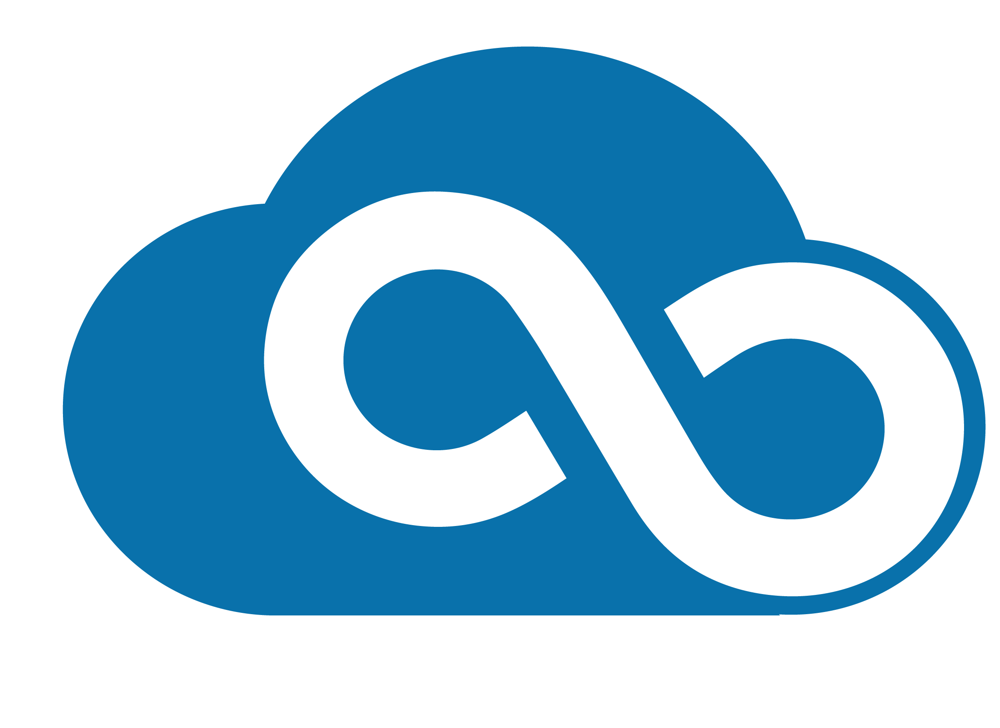

# Cloud Services

CyVerse offers several types of cloud service:

- OpenStack Virtual Machines via [{ width="20" }](https://user.cyverse.org/services/1) [Atmosphere](https://user.cyverse.org/services/1)
- Continuous Analysis via { width="20" } CACAO
- Event Driven Services via { width="20"} DataWatch

CyVerse is partnered with [Jetstream-2](https://jetstream-cloud.org/) to develop its web-interface, and to manage cloud-native applications such as Terraform, Argo Workflows, and Kubernetes.

Access to [Jetstream-2 login](https://use.jetstream-cloud.org/application) is managed through [XSEDE](https://portal.xsede.org).
