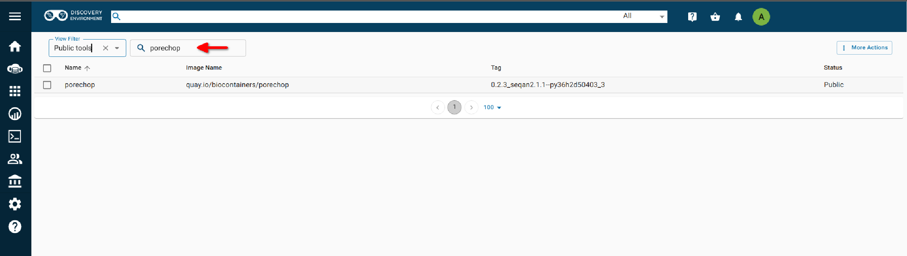
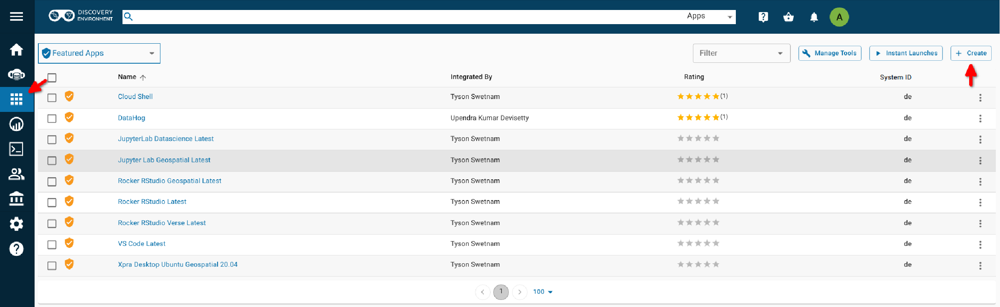
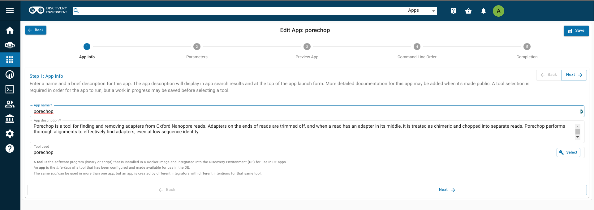
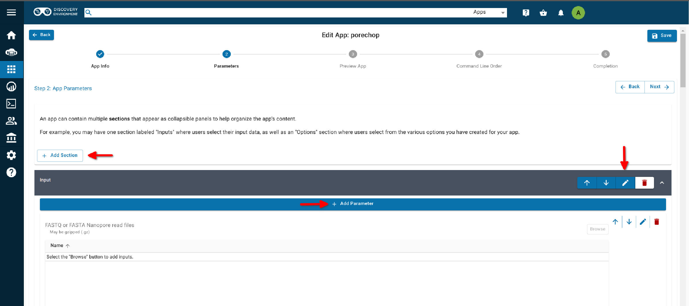
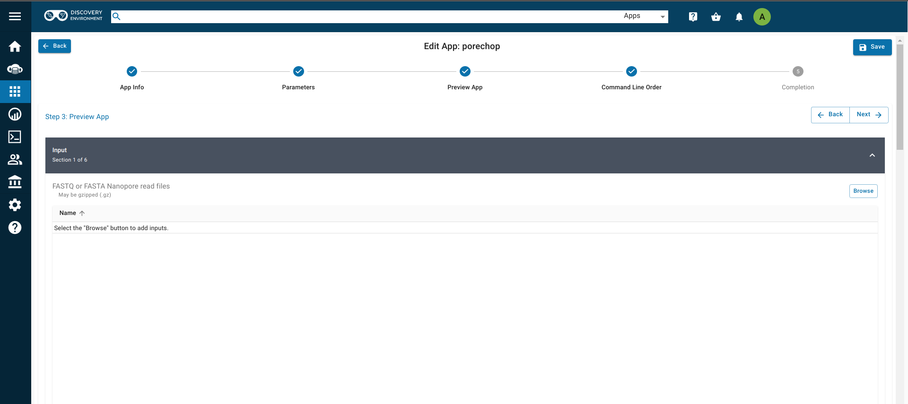
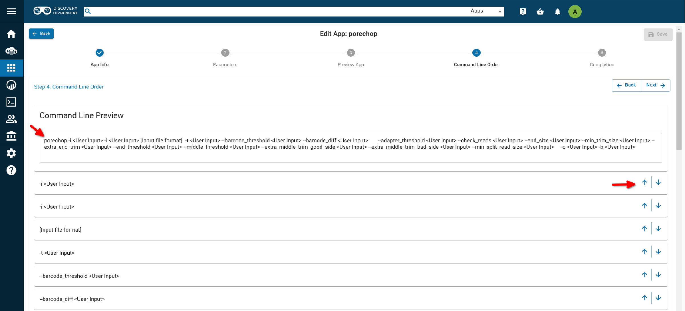
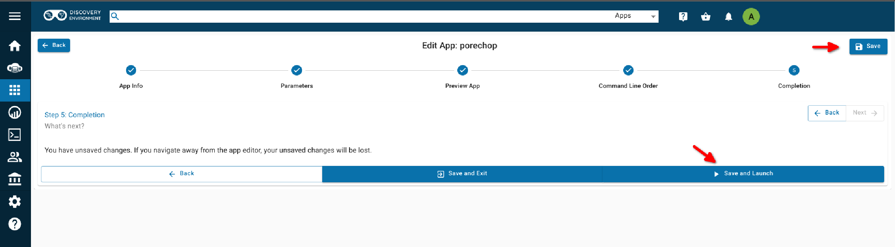

# Creating Apps in the Discovery Environment (DE)

## Why use the DE?

-   Use hundreds of bioinformatics Apps without the command line (or
    with, if you prefer)
-   Batch and interactive modes
-   Seamlessly integrated with data and high performance computing --
    not dependent on your hardware
-   Create and publish Apps and workflows so anyone can use them
-   Analysis history and provenance -- "avoid forensic bioinformatics"
-   Securely and easily manage, share, and publish data

## Types of apps

**CyVerse tool:** Software program that is integrated into the back end
of the DE for use in DE apps

**CyVerse app:** graphic interface of a tool made available for use in
the DE

 -   **Executable**: user starts an analysis and when the analysis
     finishes they can find the output files in their `\Analyses\`
     folder

      -   **DE**: run locally on our cluster
      -   **HPC**: labeled as 'Agave' in the DE. Run on XSEDE
          rsources at Texas Advanced Computing Center (TACC)
      -   **OSG**: run on the Open Science Grid

 -   **Interactive**: also called Visual and Interactive Computing
     Environment (VICE). Allows users to open Integrated Development
     Environments (IDEs) including RStudio, Project Jupyter and RShiny
     and work interactively within them.

The (containerized) tool must be integrated into the Cyverse DE first.
Then an app (interface) can be built for that tool.

## Adding a new tool

### Add Tool

1. If necessary, log into the [![][de]{width=25}](https://de.cyverse.org){target=_blank} [Discovery Environment](https://de.cyverse.org){target=_blank}.

2. Click the [![][apps]{width=20}](https://de.cyverse.org/apps){target=_blank} [Apps](https://de.cyverse.org/apps){target=_blank} and click on the "Manage Tools" wrench icon.

3. You'll see a list of all of the tools in the DE. Click on "More Actions" and select "Add Tool".

**Add Tool**

-   `Tool name` is the name of the tool. This will appear in the DE's tool listing dialog. This is mandatory field. 
-   `description` is a brief description of the tool. This will appear in the DE's tool listing dialog. 
-   `version` is the version of the tool. This will appear in the DE's tool listing dialog. This is mandatory field.
-   `Type` is the type of tool. For VICE apps, choose "interactive"; for command line applications, choose "executable".

**Container Image**

-   `Image name` is the name of the image and its public registry. This is mandatory field.
-   `Tag` is the image tag. If you don't specify the tag, the DE will look for the `latest` tag which is the default tag.
-   `Docker Hub URL` is the URL of the image on Dockerhub.

-   `Entrypoint` is the Entrypoint for your tool. Entrypoint should be present in the Docker image, and if not, you should specify it here.
-   `Working Directory` is the working directory of the tool and must be filled in with the value you gathered above, e.g., `/home/jovyan/work`.
-   `UID` is a number and must be filled in with the value you gathered from above. Typically `root` is `0` and default users are `1000`.

**Container Ports**

- `Ports` select the external port address that your graphic interface needs.

**Restrictions**

-   `Max CPU Cores` is the number of cores for your tool, e.g., 16
-   `Memory Limit` is the memory for your tool, e.g., 64 GB
-   `Min Disk Space` is the minimum disk space for your tool, e.g., 200 GB

#### Required settings

##### Set the `WORKDIR`

The container needs to have a set working directory, typically this is the home folder, e.g., `/home/jovyan` or `/home/rstudio` .

Set the `WORKDIR` in the Dockerfile; if there is no set `WORKDIR`, you can set it in the Tool Builder.

??? tip "Your Data in Your Container"

    We recommend that you set the working directory of your tool to the `username` home path in a new folder called `work`, e.g., `/home/jovyan/work` or `/home/rstudio/work`.

    This is because the Discovery Environment's interactive apps use a [Kubernetes container storage interface (CSI)](https://github.com/cyverse/irods-csi-driver){target=_blank} driver that connects the CyVerse Data Store to your working directory in the running container. This new mount can clobber any pre-existing files in the the container's `WORKDIR`. 

##### Set the `ENTRYPOINT`

The container must have an `ENTRYPOINT` set in the Dockerfile, otherwise you must set it in the Tool itself. 

1.  All commonly needed dependencies are installed in the container image - you will not have `root` privileges later.
2.  The default user set.
3.  Disable any additional authentication (CyVerse provides CAS authentication and authorization).
4.  URLs will work sanely behind a reverse proxy. If they don't, you may need to add nginx to the container.

##### Set the `PORT`

Interactive Apps rely on open ports to send display information to the browser.

Ensure the listen port for the web UI has a sane default and is set in the Dockerfile, e.g. `PORT 8888` .

You must set the port in the tool to the external port that the container is listening.

??? tip "Understanding ports in Docker containers"

    For interactive containers like RStudio and JupyterLab, a conventional `docker run` execution will have the port set as `-p 8888:8888` where the port number on the left side of the `:` is the external port, and on the right the internal port. For VICE apps you need only be concerned about the external port number.

??? tip "Using a reverse proxy"

    The Discovery Environment has its own authentication system, which requires us to use a reverse proxy for some containers. 
    
    Our [RStudio Server](https://github.com/cyverse-vice/rstudio-verse){target=_blank} uses `nginx` to enable reverse proxy and thus we have changed the external port to `80` instead of the Rocker-Project default `8787` port number.

??? tip "Managing ports in your new tool"

    Featured VICE apps have default port options based on the app: JupyterLab apps use port `8888`, RStudio apps use port `80`, and Shiny apps use port `3838`.

    It is strongly recommended you do not set the `bind to host` as `true` for your added ports when creating a new App.

After your tool template has been saved, you can create an App for connecting your tool to the Discovery Environment. You can [copy an existing app](#copy-an-existing-app) and select your tool if you like an existing App's layout. 

Alternatively, you can create a new app from a blank template.

??? tip "Input data"

    For VICE apps, be sure to check the box "Do not pass this argument to the command line" for each option you add (for VICE, this is usually just input files and folders.

## Building an App for Your Tool

You can build an app for any tool that:

-   is private to you
-   is shared with you
-   is public

**Note:**
It is a good idea to check if the tool you want is already
integrated before you start. The tool may be there already and you can
build an app using it.

From the 'Apps' tab click on the 'Manage Tools' button in the upper right.
In the 'Manage Tools' interface search for 'porechop' in the search bar
at the top. If you find the tool you want then you can build an app using that tool. For more information about the app (including other apps already using this tool) you can select it (using the checkbox to the left) and then click 'details'.

{width="600"}

Step 1: App Info

From the 'Apps' tab click on the 'Create' button in the top right corner and select 'Add App'. Choose an informative app name and description (eg. tool
name and version). Select the tool you want to build the app on buy clicking the 'select' button. This will open the 'search tools' window. Search for and select your tool.

{width="600"}

{width="600"}

Step 2: Parameters

Divide the app into sections appropriate for that tool (input, options and output are usually
sufficient sections for simple apps). You can add a section by clicking on the 'Add Section'. Once you have added a section you can edit the name by clicking on the pencil icon (right side). Within a section you can add the parameters necessary for your tool by clicking on 'Add Parameter' and choosing the type of parameter you want to add (e.g. input file). For each option you add, you will need to specify what the option is,
the argument option (if there is one) and whether that option is required. If an
option is not required be sure to check the 'exclude if nothing is
entered' box. For tools that have positional agruments (no argument option, eg.
-i) you can leave argument option blank but you will need to make sure your arguments are in the proper order in step 4.

{width="600"}

**Note:**
Although it is best to add all of the options for your tool, as it makes
the app the most useful, you can expose as many or as few options as you
like (as long as you add all the required options).

Step 3: Preview App
Make sure your app looks the way you want it to and that you have included all of the required options. If you need to make changes use the back button to return to the previous step.

{width="600"}

Step 4:  Command Line Order

This will provide a preview of what your options will look like on the command line. In the list of options below, use the up and down arrows to the right of the option to move it up or down in the list. You should see these changes reflected in the command line preview box. This order is especially important if your tool uses positional arguments.

{width="600"}

Step 5: Completion

Click 'Save' (upper right) to save your work. Then click 'Launch App' at the bottom of the page and test your app with appropriate data.

If you need to make changes to your app after testing, you can find it under the 'Apps under development' section of the 'Apps' tab. Click on the three dots menu (to the right of your app) and select 'edit app'. This will re-open the apps editor and allow you to make changes.

{width="600"}

Once you know your app works correctly you can share or publish it as
you wish. Public apps must have example data located in an appropriately
named folder here:

    `/iplant/home/shared/iplantcollaborative/example_data`

All public apps also have a brief documentation page on the [CyVerse
Wiki](https://wiki.cyverse.org/wiki/display/DEapps/List+of+Applications)

To publish your app click on the three dots menu (at the right of your app) 
and select 'Publish'. You will need to supply:

-   location of the example data
-   brief description of inputs, required options and outputs
-   link to CyVerse Wiki documentation page
-   link to docmentation for the tool (provided by the developers)

