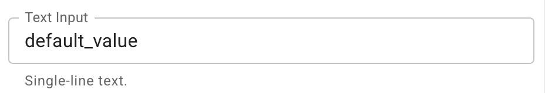
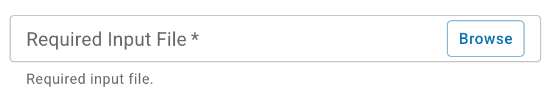
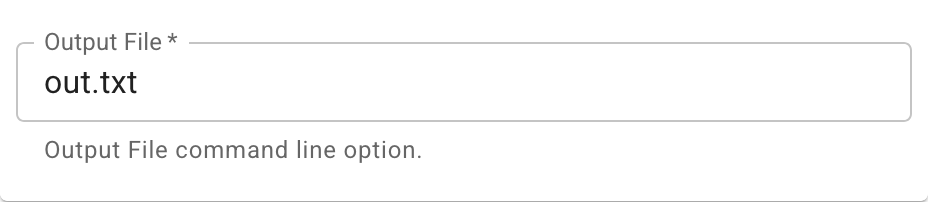
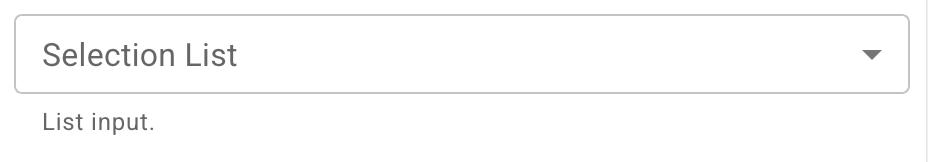
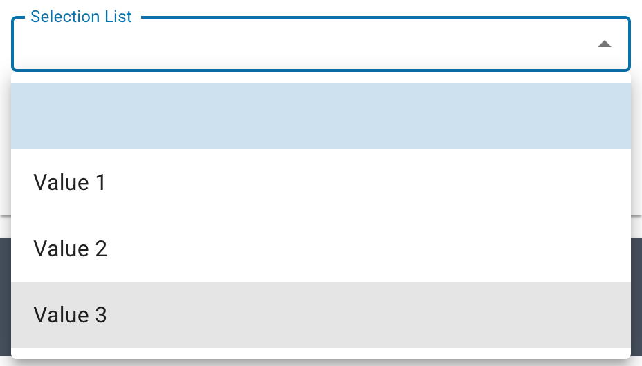
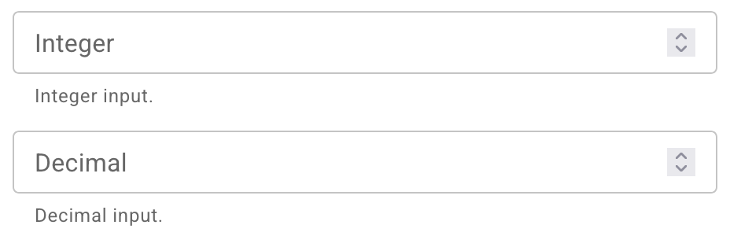

# Create HPC Apps for use in the Discovery Environment (DE)

In order to create a High-Performance Computing (HPC) app for the DE that runs at
TACC (the [Texas Advanced Computing Center](https://tacc.utexas.edu){target=_blank}),
the app must be created through the
[Tapis v3 API](https://cyverse.tapis.io){target=_blank}.

The [Tapis v3 App docs](https://tapis.readthedocs.io/en/latest/technical/apps.html){target=_blank}
can be referenced along with this guide when creating a new HPC app for the DE,
and for other details beyond the scope of this guide.

If you have created HPC apps with Tapis v2 (formerly known as Agave) for the DE in the past, then the guide
[Tapis v2 (Agave) App migration to v3 for the Discovery Environment](https://docs.cyverse.org/services/api/tapis-v2-v3-migration/){target=_blank}
can help you migrate your v2 apps so they can be used in the DE once again.

## Tapis `curl` command setup

Please note that the API server at [cyverse.tapis.io](https://cyverse.tapis.io/){target=_blank}
does provide its own UI for creating apps,
but it is limited in scope and does not allow for adding JSON `notes` fields,
which are used by the DE to display different parameter field types beyond simple text field inputs
(such as checkboxes, selection lists, and file/folder inputs).
It also does not currently allow editing of existing apps.

So this guide will use `curl` commands to interface with the `cyverse.tapis.io` API
(but there are other options detailed in the
[Tapis "Getting Started" guide](https://tapis.readthedocs.io/en/latest/getting-started/){target=_blank}).

The following shell environment variables and `curl` command aliases
will be used in the examples throughout the rest of this guide.

### Set env var `TAPIS_ACCESS_TOKEN`

Assuming the env vars `CYVERSE_USERNAME` and `CYVERSE_PASSWORD` are set,
this command will call the
[/v3/oauth2/tokens endpoint](https://tapis-project.github.io/live-docs/?service=Authenticator#tag/Tokens/operation/create_token){target=_blank}
and store the resulting Tapis JWT in the env var `TAPIS_ACCESS_TOKEN`:

    export TAPIS_ACCESS_TOKEN=$(curl -H "Content-Type: application/json" -s -d "{\"username\": \"$CYVERSE_USERNAME\", \"password\": \"$CYVERSE_PASSWORD\", \"grant_type\": \"password\" }" https://cyverse.tapis.io/v3/oauth2/tokens | jq -r .result.access_token.access_token)

Note the use of the [jq](https://jqlang.github.io/jq/) command to parse out the
`access_token` from the API response.

### Set a `curl` alias that references the `TAPIS_ACCESS_TOKEN`

    alias curl-tapis='curl -H "X-Tapis-Token: $TAPIS_ACCESS_TOKEN" -H "Content-Type: application/json"'

### List Systems

If the env vars and alias above are set up correctly,
then a command like the following
(which calls the [/v3/systems endpoint](https://tapis-project.github.io/live-docs/?service=Systems#tag/Systems/operation/getSystems){target=_blank})
should return some results.

    curl-tapis -s "https://cyverse.tapis.io/v3/systems?select=id,enabled,systemType,owner,canExec,isPublic&listType=ALL"

Note that these API endpoints return JSON output,
which can be formatted by another command like [jq](https://jqlang.github.io/jq/),
but the remaining example commands in this guide will omit piping outputs to formatting commands.

## Tapis v3 App Definition

First consider a Tapis v3 app definition like the following:

```json
{
    "id": "CyVerse-QA-Test-App",
    "version": "0.1",
    "tenant": "cyverse",
    "description": "QA Test app for all parameter types.",
    "runtime": "ZIP",
    "containerImage": "tapis://data.cyverse.org/home/shared/cyverse_training/qa-test-tool.tgz",
    "jobType": "BATCH",
    "tags": ["QA", "test"],
    "notes": {
        "name": "CyVerse QA Test App",
        "helpURI": "https://learning.cyverse.org/de/create_hpc_apps/",
        "outputs": [
            {
                "name": "requiredOutput",
                "description": "Output File command line option.",
                "arg": "out.txt",
                "details": {
                    "label": "Output File"
                }
            }
        ]
    },
    "jobAttributes": {
        "execSystemId": "stampede3",
        "maxMinutes": 100,
        "parameterSet": {
            "envVariables": [
                {
                    "key": "NEW_ENV_VAR",
                    "value": "testing env",
                    "inputMode": "INCLUDE_ON_DEMAND"
                }
            ],
            "appArgs": [
                {
                    "name": "requiredOutput",
                    "description": "Output File command line option.",
                    "arg": "out.txt",
                    "inputMode": "REQUIRED",
                    "notes": {
                        "details": {
                            "label": "Output File"
                        },
                        "value": {
                            "default": "out.txt"
                        }
                    }
                },
                {
                    "name": "textInput",
                    "description": "Single-line text.",
                    "arg": "default_value",
                    "notes": {
                        "details": {
                            "label": "Text Input"
                        }
                    }
                },
                {
                    "name": "flagInput",
                    "description": "Checkbox input.",
                    "arg": "-f",
                    "notes": {
                        "details": {
                            "label": "Flag Input"
                        },
                        "value": {
                            "type": "flag"
                        }
                    }
                },
                {
                    "name": "flagInputAlt",
                    "description": "Another Checkbox input.",
                    "arg": "-f2",
                    "notes": {
                        "details": {
                            "label": "Flag Input 2"
                        },
                        "value": {
                            "type": "string"
                        },
                        "semantics": {
                            "ontology": ["xs:boolean"]
                        }
                    }
                },
                {
                    "name": "integerInput",
                    "description": "Integer input.",
                    "notes": {
                        "details": {
                            "label": "Integer"
                        },
                        "value": {
                            "type": "number"
                        },
                        "semantics": {
                            "ontology": ["xs:int"]
                        }
                    }
                },
                {
                    "name": "doubleInput",
                    "description": "Decimal input.",
                    "notes": {
                        "details": {
                            "label": "Decimal"
                        },
                        "value": {
                            "type": "number"
                        }
                    }
                },
                {
                    "name": "listInput",
                    "description": "List input.",
                    "notes": {
                        "value": {
                            "visible": true,
                            "required": false,
                            "type": "enumeration",
                            "order": 0,
                            "default": null,
                            "enum_values": [
                                {
                                    "--list val1": "Value 1"
                                },
                                {
                                    "--list val2": "Value 2"
                                },
                                {
                                    "--list val3": "Value 3"
                                }
                            ]
                        },
                        "details": {
                            "label": "Selection List"
                        }
                    }
                },
                {
                    "name": "requiredInput",
                    "description": "Required input file.",
                    "inputMode": "REQUIRED",
                    "notes": {
                        "details": {
                            "label": "Required Input File"
                        }
                    }
                },
                {
                    "name": "optionalInput",
                    "description": "Not required, excluded if empty.",
                    "notes": {
                        "details": {
                            "label": "Optional Input File"
                        }
                    }
                }
            ]
        },
        "fileInputs": [
            {
                "name": "requiredInput",
                "description": "Required input.",
                "inputMode": "REQUIRED",
                "targetPath": "*"
            },
            {
                "name": "optionalInput",
                "description": "Not required, excluded if empty.",
                "targetPath": "*"
            },
            {
                "name": "fixedInput",
                "description": "Fixed input.",
                "inputMode": "FIXED",
                "sourceUrl": "tapis://data.cyverse.org/home/shared/cyverse_training/example/coffee_cake.txt",
                "targetPath": "*"
            }
        ]
    }
}
```

If this app JSON was saved in a file named `app.json`,
then this app can be created with a command like the following,
which calls the
[POST /v3/apps endpoint](https://tapis-project.github.io/live-docs/?service=Apps#tag/Applications/operation/createAppVersion){target=_blank}:

    curl-tapis -s -d @app.json https://cyverse.tapis.io/v3/apps

If the app needs to be updated,
save the updates to the same file and update the app with the
[PUT /v3/apps endpoint](https://tapis-project.github.io/live-docs/?service=Apps#tag/Applications/operation/putApp){target=_blank}:

    curl-tapis -s -X PUT -d @app.json "https://cyverse.tapis.io/v3/apps/CyVerse-QA-Test-App/0.1"

## Tapis v3 App Details

### The `notes` Field

The DE will use an app's `notes` fields to decide how to display and validate certain app fields and parameters,
such as app and parameter `name` and `label` display fields,
if those `notes` fields are formatted
[similar to Tapis v2 app fields](https://docs.cyverse.org/services/api/tapis-v2-v3-migration/){target=_blank}.

The DE will use the app's `notes.label` or `notes.name`,
followed by the app's `version`,
when displaying the app name in listings or the in the app launch form.
If no `label` or `name` is found in the app's `notes`,
then the DE will simply use the app's `id`.

### Parameters and App Args

Now take the following `appArgs` parameter, for example:

```json
{
  "name": "textInput",
  "description": "Single-line text.",
  "arg": "default_value",
  "notes": {
    "value": {
      "visible": true,
      "required": false,
      "type": "string",
      "default": "default_value"
    },
    "details": {
      "label": "Text Input"
    }
  }
}
```

If a `notes.details.label` field is not present,
then the DE will use the `name` as the parameter's form field label.
The `description` will be used as the help text displayed below the form field in the DE.

Note that the `visible`, `required`, and `type` fields could be omitted from the `notes` in this example,
since those are the defaults the DE will use for those parameter fields.

This text field will render like this in the DE's app launch form:

<figure markdown>
{ width="464" }
<figcaption>Text Form Field</figcaption>
</figure>

If the parameter has an `inputMode` field with a `REQUIRED` value,
then the DE will treat that parameter as required and ignore the
`notes.value.required` field.

If the parameter has an `inputMode` field with a `FIXED` value,
then the DE will treat that parameter as hidden and ignore the
`notes.value.visible` field.

The `notes` object can contain any other custom fields,
which will be ignored by the DE,
except for certain fields in specific parameter types,
detailed in the following sections.

### Parameter Types

#### Inputs

If an input value is also required as a parameter on the command line,
then the `name` of the input in the `fileInputs` parameter field
should match the `name` of the corresponding `appArgs` parameter (or the `key` of the corresponding `envVariables` parameter).

The `requiredInput` field from the example above will render like this in the DE's app launch form:

<figure markdown>
{ width="464" }
<figcaption>File/Folder Input Field</figcaption>
</figure>

If the app's `runtime` value is `DOCKER`,
then the DE will automatically prepend `/TapisInput/`
to the file or folder name submitted by the user,
since that is the directory mounted inside the container by Tapis for inputs.
Otherwise only the base name of the file or folder will be submitted
for the command line argument.

#### Outputs

The `outputs` field is not used by Tapis, but if a user wishes to create a
pipeline workflow with multiple Tapis and DE apps,
then the DE requires an app output to be defined so that it can be used as an
app's input in a subsequent step in the workflow.
If the output value is also required as a parameter on the command line,
then the `name` of the output in the `notes` field should match the `name` of the
corresponding `appArgs` parameter (or the `key` of the corresponding `envVariables` parameter).

The `requiredOutput` field from the example above will render like this in the DE's app launch form:

<figure markdown>
{ width="464" }
<figcaption>Output Field</figcaption>
</figure>

If the app's `runtime` value is `DOCKER`,
then the DE will automatically prepend `/TapisOutput/`
to the parameter value submitted by the user,
since that is the directory mounted inside the container by Tapis for outputs.
Otherwise the DE will automatically prepend `output/`
to the parameter value submitted by the user,
since that is the directory created and used by Tapis for app outputs.

#### Flags or Booleans

If the parameter has a `notes.value.type` field value of `bool`, `boolean`, or `flag`,
then the DE will display that parameter as a checkbox.
Parameters with a `notes.semantics.ontology` list where the first value is
`xs:boolean` will also display as a checkbox.

Note that the value of a parameter's `arg` is used in job submissions
when the user checks a flag parameter type in the submission form.

The `flag` fields from the example above will render like this in the DE's app launch form:

<figure markdown>
{ width="464" }
<figcaption>Flag Input Fields</figcaption>
</figure>

#### Enumeration Lists

If the parameter has a `notes.value.type` field value of `enumeration`,
then the DE will display that parameter as a selection list.

The parameter should also have a `notes.value.enum_values` field
with an array of object values.

Each of these enum objects should have a key
that is the full command line argument that should be submitted as the parameter's `arg` value in the job submission,
and a value that will be used as the display label by the DE in the form's selection list.

The `listInput` field from the example above will render like this in the DE's app launch form:

<figure markdown>
{ width="464" }
<figcaption>List Selection Field</figcaption>
</figure>

<figure markdown>
{ width="464" }
<figcaption>List Selection Field Expanded</figcaption>
</figure>

#### Numbers

If the parameter has a `notes.value.type` field value of `number`,
then the DE will display that parameter as a number field.
The DE will use the first `xs:*` value in the `notes.semantics.ontology` field to
determine if the user's input should be restricted to integers or decimal values.

See https://github.com/cyverse-de/mescal/blob/main/src/mescal/tapis_de_v3/params.clj
for a list of supported number XSD types (otherwise defaulting to decimal values).

The `integerInput` and `doubleInput` fields from the example above will render like this in the DE's app launch form:

<figure markdown>
{ width="464" }
<figcaption>Number Input Fields</figcaption>
</figure>

### Make App Public

Once the app is tested and ready for sharing with all DE users,
you can make the app public with the
[/v3/apps/share_public endpoint](https://tapis-project.github.io/live-docs/?service=Apps#tag/Sharing/operation/shareAppPublic){target=_blank}:

    curl-tapis -s -X POST "https://cyverse.tapis.io/v3/apps/share_public/CyVerse-QA-Test-App"
