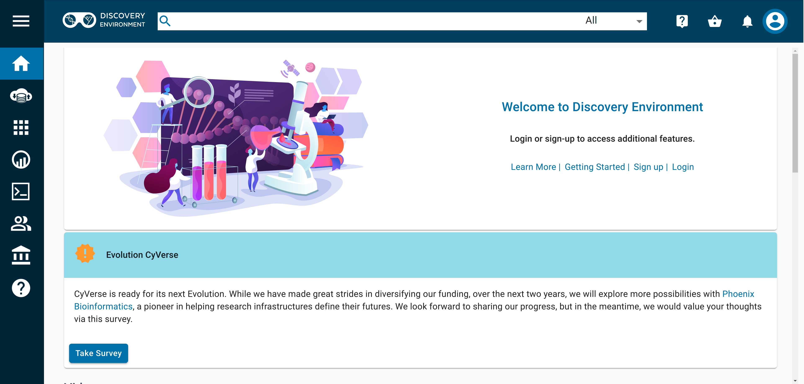
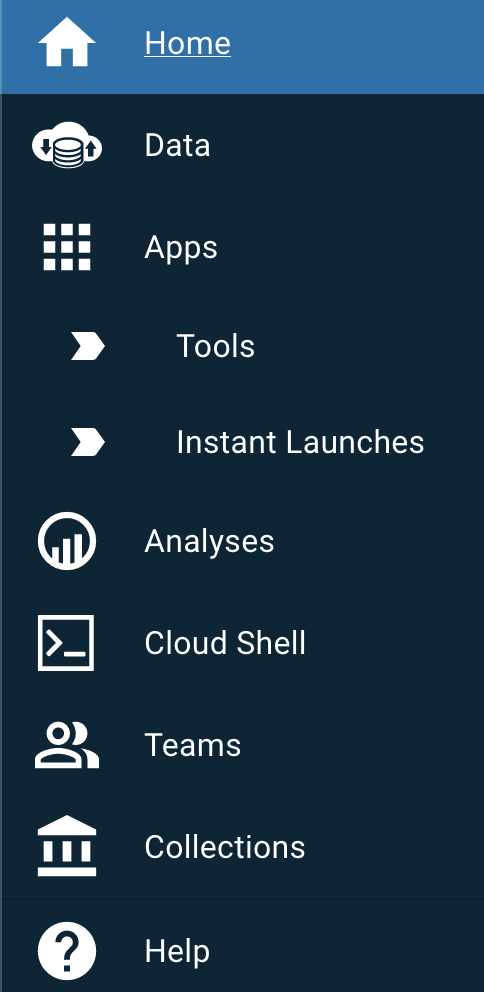
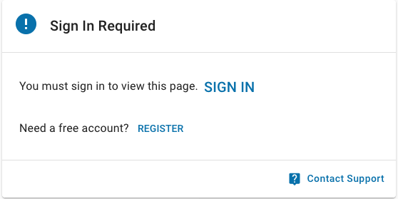
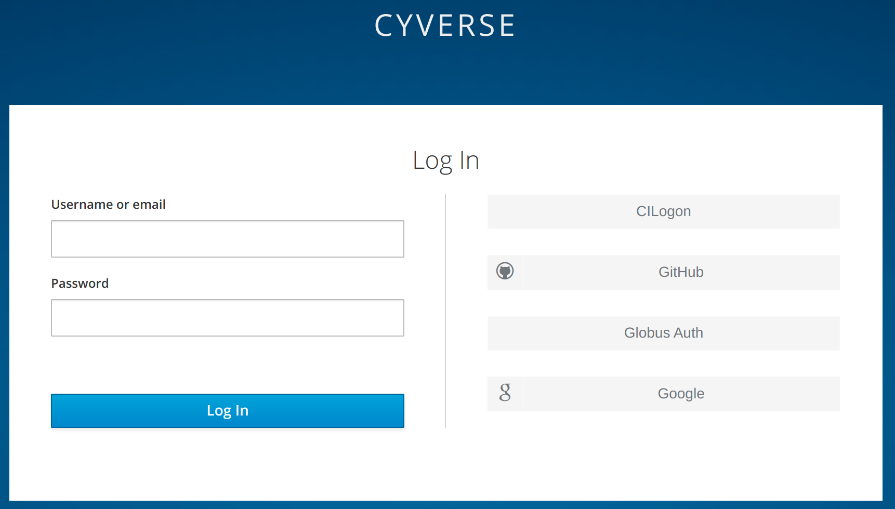

# Logging in to the Discovery Environment (DE)

[de]: ../assets/de/logos/deIcon.svg
[data]: ../assets/de/menu_items/dataIcon.svg
[analyses]: ../assets/de/menu_items/analysisIcon.svg
[apps]: ../assets/de/menu_items/appsIcon.svg
[help]: ../assets/de/menu_items/helpIcon.svg
[home]: ../assets/de/menu_items/homeIcon.svg
[profile]: ../assets/de/icons/userIcon.svg

When you first open the [![de]{width="25"} Discovery Environment](https://de.cyverse.org){target=_blank}, you'll see the [![home]{width="25"} Home](https://de.cyverse.org/home) Dashboard.

{width="600"}

The [![home]{width="25"} Home](https://de.cyverse.org/home) Dashboard contains links to [News](https://cyverse.org/news){target=_blank}, recent [YouTube Videos](https://www.youtube.com/c/CyverseOrgProject){target=_blank}, & Featured Apps. 

The left side navigation menu shows icons for accessing different parts of the DE. The menu can be expanded by clicking on the three bars in the top left. 

{width="200"}

Sign in from the upper right corner of the DE and click the ![profile]{width="25"} profile icon or clicking the [Login](https://de.cyverse.org/#){target=_blank} link. If you attempt to view the Data Store or launch an App, you will see a pop-up:

{width="300"}

When signing in you will be redirected to our Authentication Service. Enter your CyVerse username and password. 

If you don't have an account yet or you've forgotten your password, you can visit <https://user.cyverse.org>{target=_blank} to create an account.

{width="600"}

After logging in, you'll be returned to the [![home]{width="25"} Home](https://de.cyverse.org/home) Dashboard. 

If you were already on the [![apps]{width="25"} Apps](https://de.cyverse.org/apps){target=_blank} or [![data]{width="25"} Data](https://de.cyverse.org/data){target=_blank} when you logged in, you'll return to that page.

You can take a short tour of the DE's main features by clicking the [help icon ![help]{width="25"}](https://de.cyverse.org/help){target=_blank} in the left sidebar and selecting "Product Tour".
