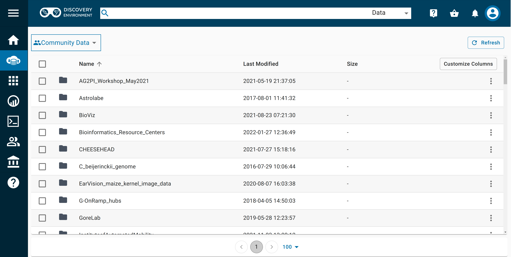
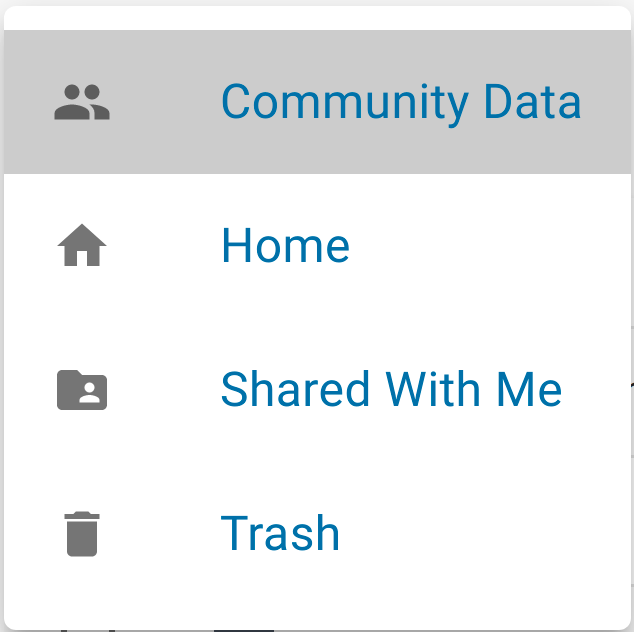
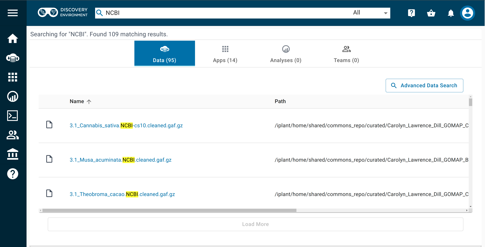

# Managing Data in the Discovery Environment

With CyVerse, you can manage data throughout the data lifecycle, from uploading, to adding metadata, to analyzing, sharing results, and making your data public for others to reuse. 

The [![de]{width="25"} Discovery Environment](https://de.cyverse.org){target=_blank} interface is just one of many ways to access, view, and manage your files in the [Data Store](../ds/index.md).

??? Tip "Where is the Data Store?"
    The Data Store is not a separate platform; it is a service that 
    crosscuts all of CyVerse so you can access your files (yours, shared with you, public) from anywhere in CyVerse.
    
## Browsing Data in the Discovery Environment

[de]: ../assets/de/logos/deIcon.svg
[data]: ../assets/de/menu_items/dataIcon.svg
[analyses]: ../assets/de/menu_items/analysisIcon.svg
[apps]: ../assets/de/menu_items/appsIcon.svg
[help]: ../assets/de/menu_items/helpIcon.svg
[home]: ../assets/de/menu_items/homeIcon.svg
[profile]: ../assets/de/icons/userIcon.svg

1.  After logging in, click on the [![data]{width="25"} Data](https://de.cyverse.org/data){width="25"} icon in the left navigation menu.

    

    To see and browse information about your data files in the Data view, press the "Customize Columns" button to select more (or fewer) columns to display, such as size, modification date, permissions, etc.

2.  If the folder you're viewing has many items in it, use the < or > at the bottom of the page to move between pages. You can also change the number of items displayed per page.

3.  In the upper left, you should see a "Community Data" box. If you click on this box, you can change directories to view your data files ("Home"), or data shared with your username ("Shared with me"), or files in your "Trash". 

    {width="200"}

    As you access the folders or files within your directory, breadcrumbs near the top of the page show the folder you are viewing and its parent folder(s).

4.  At the start of the breadcrumbs, you may select another root folder to view from within your home folder; click on the dropdown near your username to browse folders/files in "Shared With Me", "Community Data", or "Trash".

## Viewing File/Folder Details in the Discovery Environment

Both the "Details" button near the top right and the More Options menu (ellipses) at the far right in a file or folder's row allow you to view and manage several types of information about your file/folder.

You must be logged in to view file/folder details.

1.  From the [![data]{width="25"} Data](https://de.cyverse.org/data){width="25"} view, click the checkbox next to a file or folder to select it and then click the "Details" or the ellipses to see specific information about
    the selected item, to copy the file path to the item, to add tags to the item, to edit metadata, or to set a file's info type.

2.  To view your permissions on the item and those of other users, click the "Permissions" tab under "Details".

## Uploading Files/Folders to the Data Store via the Discovery Environment

The Data view shows a directory of the files and folders in your Data Store. 

You can select an existing folder as the destination for your uploaded file(s) or click the **Folder** button to create a new folder. The default file destination is your home Data Store folder (i.e., `/iplant/home/<your_username>`).

Click the "Upload" button to choose your options for importing files into the Data Store:

- To upload files from your local computer, choose **Browse Local**; a file browser will open and you may select files to upload.
    
- To upload files from a URL, choose **Import by URL**; you may paste in a valid HTTP or an FTP URL, then click **Import**. You may paste additional URLs or close the window by clicking **Done**.

- When you have begun the upload, you will get an automated notification that the file(s) has been queued. To view the status of an upload or import, click the **Upload** button and choose **View Upload Queue**.

## Deleting Files/Folders in the Discovery Environment

You must be logged in and you must own the files or folders you wish to delete. 

From the [![data]{width="25"} Data](https://de.cyverse.org/data) view, select the desired file/folder by clicking the checkbox to its left. You can select multiple files/folders. To unselect an individual file/folder, click the checkbox again. You can select (or unselect) all files/folders at once by clicking the checkbox at the top of the list.

Click on the More Options menu (ellipsis) in the upper right corner of the [![data]{width="25"} Data](https://de.cyverse.org/data) view and select **Delete** from the pop-up menu. When the file has been fully deleted, you will receive an automated notification (bell icon, upper right). When deleting or moving a file/folder, you cannot change anything associated with that file/folder until you receive the completion notification.

Deleted files can be retrieved from your Trash. 
      
??? Tip "Uploading/Importing Data via the Browser"

    - You can use the DE interface to upload files of <2GB to the Data Store.

    - When your Data Store file browser is open, you can also upload files from your computer by dragging them into your browser window.

    - While uploading or downloading data via your browser, you must remain on the Data View until the task completes.

    - The queue will only display the status of uploads from local files. 
    
    - Files imported by URL will generate an automated notification upon completion (or failure) to upload.

    - When importing data from a URL, you can log out or navigate to another page or operation after you start the import; you will recieve an automated email notification when the task is complete.

    - For larger files or large numbers of files, we recommend using other methods such as [Cyberduck](../ds/cyberduck.md) or [iCommands](../ds/icommands.md). 

## Advanced Data Management Features in the Discovery Environment

The Discovery Environment also supports advanced data management tasks such as organizing your datasets, search, adding metadata to data, requesting a Digital Object Identifier (DOI), and importing or submitting data to/from NCBI SRA. 

To use the Advanced Search, run a query in the Search menu, then select "Advanced Search Options".

{width="600"}

