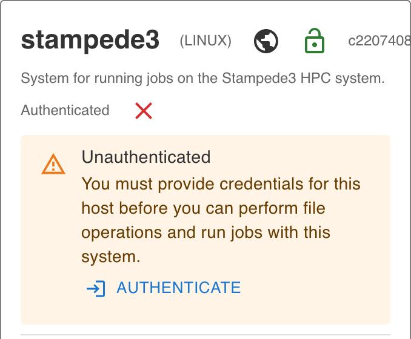
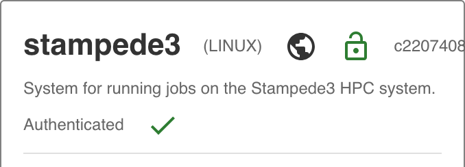

# Using Apps in the Discovery Environment

[de]: ../assets/de/logos/deIcon.svg
[apps]: ../assets/de/menu_items/appsIcon.svg
[vice]: ../assets/de/logos/deviceIcon.svg

You can select from several hundred applications (Apps) available in the [![de]{width="25"} Discovery Environment](https://de.cyverse.org){target=_blank} when you are ready to analyze your data.

!!! tip "When launching [![apps]{width="10"} Apps](https://de.cyverse.org/apps){target=_blank}, you can log out or navigate to another page or operation after you start the task; an automated email notification is sent to you when those tasks are completed"

## Browsing Apps in the Discovery Environment

You must be logged in to browse and use apps.

1. Click in the left sidebar of the DE to see the [![apps]{width="25"} Apps](https://de.cyverse.org/apps){target=_blank} view. When you first access the Apps view, you may be prompted to log in. After logging in, you will see a screen that looks something like this:

<figure markdown>
{ width="600" }
<figcaption>The Apps page.</figcaption>
</figure>

## Sorting and Filtering Apps in the Discovery Environment

To sort the list of apps in ascending or descending order by app name, the name of the person who integrated the app, or its average rating, click on the column headings. 

You can navigate between pages and change how many apps are listed on a page by using the < or > controls at the bottom of the page.

By default, the Apps view displays "**Featured Apps**" which are interactive.

All "**Public Apps**" are available to you. 

With hundreds of apps and sometimes many versions of an app in the DE, you may want to view a subset of all available apps. There are two ways to do this. 

First, in the upper left corner of the [![apps]{width="25"} Apps](https://de.cyverse.org/apps){target=_blank} view, the currently active subset of apps is shown as the primary filter. 

Click the drop-down arrow next to the currently active subset to select a different apps subset to display:

The currently selected app subset is highlighted in gray. The available app subsets are:

| Application type | Description |
|------------------|-------------|
| Apps under development | Apps that you have added to the DE that have not been made public |
| Favorite apps | Apps that you have marked as favorite apps in the DE |
| My public apps | Apps that you have added to the DE that have been made publicly available |
| Shared with me | Apps that other users have shared with you |
| High-Performance Computing | Apps that run at the Texas Advanced Computing Center using the Tapis API |
| Browse All Apps | All apps available to you in the DE |

You can further reduce the list of the apps displayed by selecting a filter. 

Click the drop-down arrow in the Filter control (upper right corner of the Apps view) to select the type of apps you'd like to see in the listing:

The currently selected filter is displayed in the Filter control itself.

If no filter is selected, the control will be empty. The currently available app filters are:

| Application filter | Description |
|--------------------|-------------|
| HPC | High-Performance Computing apps that run using the Tapis API |
| DE | Executable (non-interactive apps) that run on CyVerse computing resources |
| VICE | Interactive development environments (e.g., Jupyter, RStudio, R Shiny) and other apps with their own interactive interfaces |
| Open Science Grid (OSG) | Executable (non-interactive apps) that run on OSG resources |

The app filter you selected will be displayed in the Filter control.

## Viewing App Details in the Discovery Environment

When you've found an app of interest, select it by clicking the checkbox to the left of the app name. 

A *Details* button will appear in the upper right corner of the Apps view, just to the right of the Filter control.

Click the Details button to see additional information about the app (e.g., description, number of times run, etc.).

The Details panel has several controls available. 

Click the Heart icon to add that app to your list of favorite apps (to remove from your favorite list, click the heart again). 

The heart will be solid blue if the app is already on your list of favorites. 

Click the Link icon to display a link to the app that you can copy and share with other CyVerse users. 

The Stars icon labeled `Your rating` allows you to rate the app. 

The `Tools used by this App` tab contains information about the underlying tools (steps) the app uses to perform an analysis. 

To dismiss the App Details view, click anywhere outside the panel.

??? tip "Create a Favorites list"

    Favorite your frequently used apps to make them easier and faster to find next time.

## About VICE Apps in the Discovery Environment

One type of app that you can filter for in the [![de]{width="25"} Discovery Environment](https://de.cyverse.org){target=_blank} are [![vice]{width="25"}](https://de.cyverse.org){target=_blank} (VICE stands for Visual Interactive Computing Environment). VICE apps are interactive apps that include a Graphical User Interface (GUI) or an Integrated Development Environment (IDE) such as Project Jupyter, RStudio, or remote desktops to the DE.

You must request special access and be approved to use VICE apps through the CyVerse User Portal .

## About HPC Apps in the Discovery Environment

Most DE apps that are listed in the High-Performance Computing (HPC) category,
as well as CyVerse apps which run through the [Tapis API](https://tapis.readthedocs.io){target=_blank},
run at [TACC](https://tacc.utexas.edu){target=_blank} (the Texas Advanced Computing Center),
and mainly on their [Stampede3 system](https://docs.tacc.utexas.edu/hpc/stampede3/){target=_blank}.
Access to this powerful resource is made available through a grant from the National Science Foundation.
Stampede3 allocation requests must be made through the NSF's [ACCESS](https://allocations.access-ci.org){target=_blank} project.

### Authenticating with TAPIS and Stampede3

In order to use HPC Apps in the DE that run on TACC's Stampede3 system,
follow their [Getting Started guide](https://tacc.utexas.edu/use-tacc/getting-started/){target=_blank}
to register for a TACC account and to request a Stampede3 allocation.
Be sure to choose the same username for your TACC account as your CyVerse username.

After your TACC account is activated, navigate to [cyverse.tapis.io](https://cyverse.tapis.io/){target=_blank}
and log in at that page with your **CyVerse credentials**
(disregard the help messages in the login form that asks for your TAPIS name and password).

Then navigate to the Systems page and find the public
[stampede3 system](https://cyverse.tapis.io/#/systems/stampede3){target=_blank}.
Near the top of the `stampede3` details page,
there will be a display that checks if you have "Authenticated"
with this `stampede3` system with your **TACC credentials**.

If this section displays a message that you are unauthenticated,
then it will provide an "Authenticate" link that you can select
which will display a form for you to enter your **TACC account password**.

<figure markdown>
{ width="338" }
<figcaption>Unsuccessful Stampede3 Authentication Check</figcaption>
</figure>

After entering your TACC account password,
refreshing this page should display a successful authentication check.

<figure markdown>
{ width="338" }
<figcaption>Successful Stampede3 Authentication Check</figcaption>
</figure>

This is a one-time authentication required for DE HPC apps running on the `stampede3` system.

### Understanding HPC queues

In order to fairly distribute this high-demand resource,
TACC follows allocation policies that limit how long any single analysis can be run
(usually 24 or 48 hours, depending on the queue),
how many analyses a user can have running simultaneously,
and the total amount of computational time any one user can access over the course of a year.
Analyses (also known as jobs) submitted through the CyVerse DE run at TACC using the same queues as every other scientist in the country uses.
Thus, if there are many analyses or a few very large analyses in the queue,
the wait time for each analysis can be very long,
up to several days for certain apps.

Queues on HPC systems are much like queues at the coffee shop:
the first analysis submitted is the first one to run.
However, to efficiently exploit resources,
HPC queues also have features similar to amusement parks that squeeze single riders in with larger groups.
On an HPC system, this consists of scheduling jobs that are shorter or that use fewer nodes into smaller blocks that can be placed in between longer jobs.
Supercomputing centers generally have more than one supercomputer,
and the supercomputers have multiple queues for different types of analyses
(e.g., serial, parallel, large memory).
Each center/computer/queue has its own rules and algorithms for ensuring fair and efficient allocation of resources.

Users or groups who have very large computational needs are likely to run into bottlenecks using standard CyVerse infrastructure.
We recommend that these users
[apply for their own ACCESS allocation](https://allocations.access-ci.org){target=_blank},
which will allow them to run CyVerse tools and applications at TACC with fewer restrictions.
Users or groups with very large computational needs should first apply for a startup allocation and use it to benchmark their jobs,
thereby collecting data on efficiency of resource use which must be part of a full ACCESS allocation request.

Want to learn more about ACCESS?
Visit the [ACCESS home page](https://access-ci.org){target=_blank}.

## Advanced Features in the Discovery Environment

The Discovery Environment also supports advanced features for apps such as integrating different types of apps into the DE, creating and running containers, and using Application Programming Interfaces (APIs) for programmatic backend access to CyVerse services. 

For how-to information on these features, see our [Developer Manuals](../dev/manuals.md), [Extending VICE Apps](vice/extend_apps.md), and our [Powered By](../home/powered_by.md) documentation.
