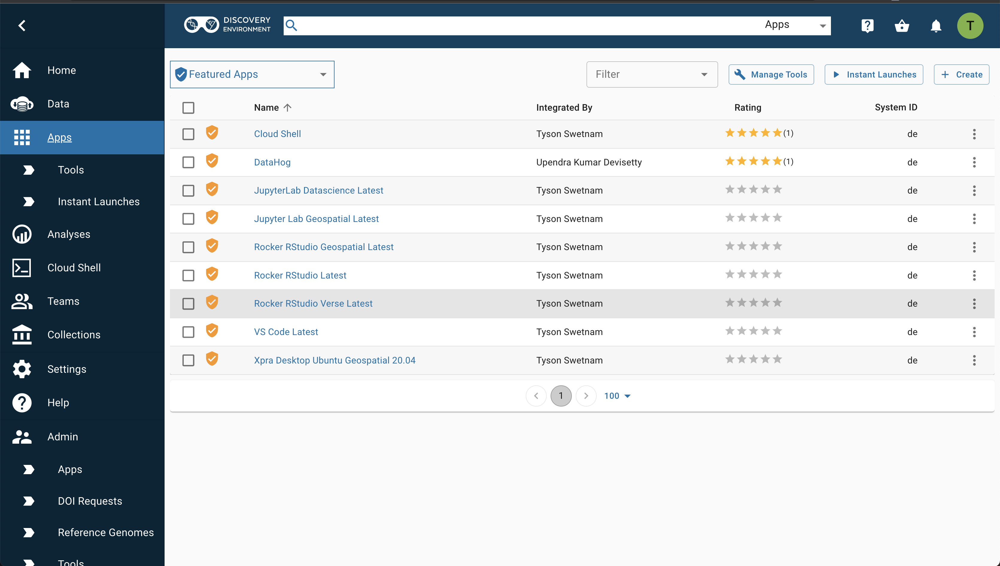

# Using Apps in the Discovery Environment

[de]: ../assets/de/logos/deIcon.svg
[data]: ../assets/de/menu_items/dataIcon.svg
[analyses]: ../assets/de/menu_items/analysisIcon.svg
[apps]: ../assets/de/menu_items/appsIcon.svg
[help]: ../assets/de/menu_items/helpIcon.svg
[home]: ../assets/de/menu_items/homeIcon.svg
[profile]: ../assets/de/icons/userIcon.svg
[vice]: ../assets/de/logos/deviceIcon.svg

You can select from several hundred applications (apps) available in the [![de]{width="25"} Discovery Environment](https://de.cyverse.org){target=_blank} when you are ready to analyze your data.

??? tip "Launching Apps"

    When launching [![apps]{width="25"} Apps](https://de.cyverse.org/apps){target=_blank}, you can log out or navigate to another page or operation after you start the task; an automated email notification is sent to you when those tasks are completed

## Browsing Apps in the Discovery Environment

You must be logged in to browse and use apps.

1. Click in the left sidebar of the DE to see the [![apps]{width="25"} Apps](https://de.cyverse.org/apps){target=_blank} view. When you first access the Apps view, you may be prompted to log in. After logging in, you will see a screen that looks something like this:

{ width="600" }

## Sorting and Filtering Apps in the Discovery Environment

To sort the list of apps in ascending or descending order by app name, the name of the person who integrated the app, or its average rating, click on the column headings. 

You can navigate between pages and change how many apps are listed on a page by using the < or > controls at the bottom of the page.

By default, the Apps view displays "Featured Apps" which are interactive.

All "Public Apps" are available to you. 

With hundreds of apps and sometimes many versions of an app in the DE, you may want to view a subset of all available apps. 

There are two ways to do this. 

First, in the upper left corner of the [![apps]{width="25"} Apps](https://de.cyverse.org/apps){target=_blank} view, the currently active subset of apps is shown as the primary filter. 

Click the drop-down arrow next to the currently active subset to select a different apps subset to display:

The currently selected app subset is highlighted in gray. The available app subsets are:

| Application type | Description |
|------------------|-------------|
| Apps under development | Apps that you have added to the DE that have not been made public |
| Favorite apps | Apps that you have marked as favorite apps in the DE |
| My public apps | Apps that you have added to the DE that have been made publicly available |
| Shared with me | Apps that other users have shared with you |
| High-Performance Computing | Apps that run at the Texas Advanced Computing Center using the Tapis API |
| Browse All Apps | All apps available to you in the DE |

You can further reduce the list of the apps displayed by selecting a filter. 

Click the drop-down arrow in the Filter control (upper right corner of the Apps view) to select the type of apps you'd like to see in the listing:

The currently selected filter is displayed in the Filter control itself.

If no filter is selected, the control will be empty. The currently available app filters are:

| Application filter | Description |
|--------------------|-------------|
| HPC | High Performance Computing apps that run using the Tapis API |
| DE | Executable (non-interactive apps) that run on CyVerse computing resources |
| VICE | Interactive development environments (e.g., Jupyter, RStudio, R Shiny) and other apps with their own interactive interfaces |
| Open Science Grid (OSG) | Executable (non-interactive apps) that run on OSG resources |

The app filter you selected will be displayed in the Filter control.

## Viewing App Details in the Discovery Environment

When you've found an app of interest, select it by clicking the checkbox to the left of the app name. 

A *Details* button will appear in the upper right corner of the Apps view, just to the right of the Filter control.

Click the Details button to see additional information about the app (e.g., description, number of times run, etc.).

The Details panel has several controls available. 

Click the Heart icon to add that app to your list of favorite apps (to remove from your favorite list, click the heart again). 

The heart will be solid blue if the app is already on your list of favorites. 

Click the Link icon to display a link to the app that you can copy and share with other CyVerse users. 

The Stars icon labeled `Your rating` allows you to rate the app. 

The `Tools used by this App` tab contains information about the underlying tools (steps) the app uses to perform an analysis. 

To dismiss the App Details view, click anywhere outside the panel.

??? tip "Create a Favorites list"

    Favorite your frequently used apps to make them easier and faster to find next time.

## About VICE Apps in the Discovery Environment

One type of app that you can filter for in the [![de]{width="25"} Discovery Environment](https://de.cyverse.org){target=_blank} are [![vice]{width="25"}](https://de.cyverse.org){target=_blank} (VICE stands for Visual Interactive Computing Environment). VICE apps are interactive apps that include a Graphical User Interface (GUI) or an Integrated Development Environment (IDE) such as Project Jupyter, RStudio, or remote desktops to the DE.

You must request special access and be approved to use VICE apps through the CyVerse User Portal .

## Advanced Features in the Discovery Environment

The Discovery Environment also supports advanced features for apps such as integrating different types of apps into the DE, creating and running containers, and using Application Programming Interfaces (APIs) for programmatic backend access to CyVerse services. 

For how-to information on these features, see our [Developer Manuals](../manuals.md) , [Extending VICE Apps](../extend_apps.md) , and our [Powered By](../powered_by.md) documentation.

-----------------------------------------------------------------------

**Fix or improve this documentation**

  - Search for an answer:
     [CyVerse Learning Center](https://learning.cyverse.org)
  - Ask us for help:
    click the Intercom icon { width="25" } on the lower right-hand side of the page
  - Report an issue or submit a change:
    [Github Repo Link](https://github.com/cyverse-learning-materials/)
  - Send feedback: <Tutorials@CyVerse.org>
  
------------------------------------------------------------------------
