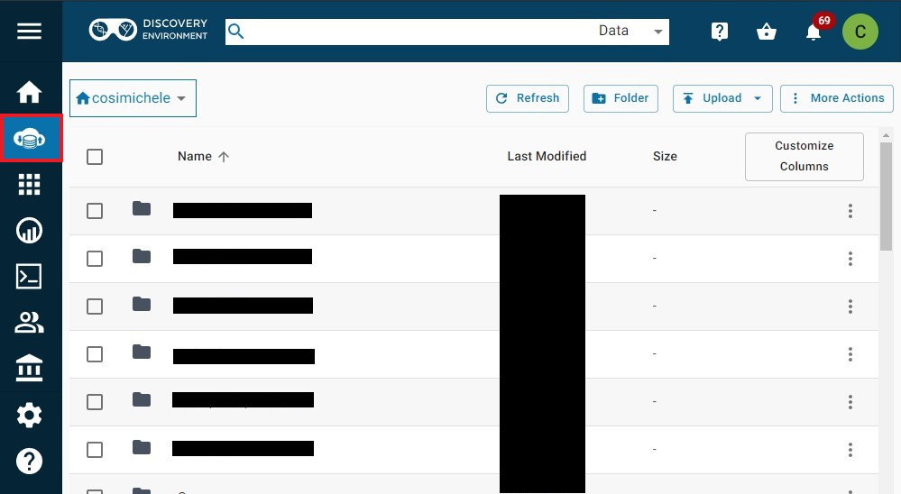
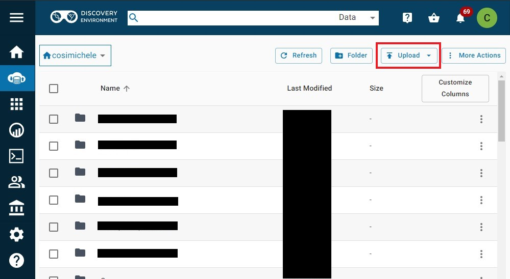
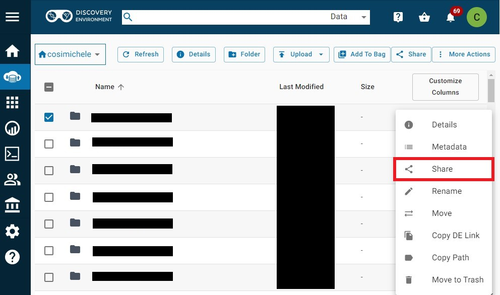
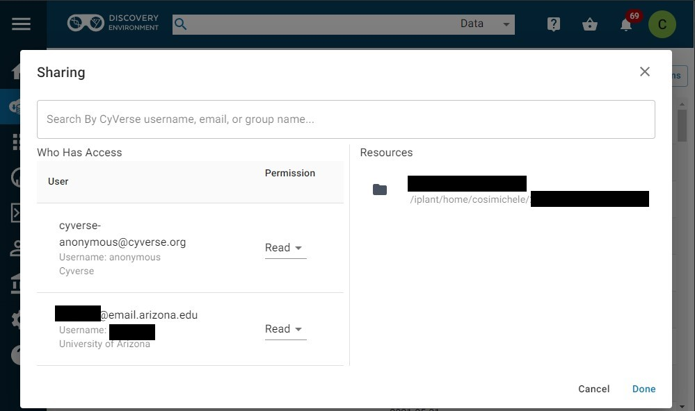

# Sharing Data in the Discovery Environment

[de]: ../../assets/de/logos/deIcon.svg
[data]: ../../assets/de/menu_items/dataIcon.svg

!!! Note "This quickstart is focused on using the Discovery Environment to upload your data. For more information on alternative methods for data management, please refer to the [Manage Your Data](index.md) section or the [Data Sharing](share.md) page."

1. Log into the [![de]{width="25"} Discovery Environment](https://de.cyverse.org){target=_blank}.

2. Open the [![data]{width="25"} Data](https://de.cyverse.org/data){target=_blank} icon on the left.

    

3. Click the **Upload** button on the top right; in the dropdown menu that appears, select the preferred upload method (*Browse Local* or *Import from URL*). Additionally, you can also view your upload queue.

    

4. Once your file(s) is uploaded, click on the ellipses (3 dots) on the right of the file. This will open a dropdown menu with a number of options; Choose **Share**.

    

5. In the Share window, choose which CyVerse collaborator to share with. If your collaborator is not a registered CyVerse user, choose *anonymous*.

    

6. You can also generate a public URL for files, making it easier to share your files. To do so, click on the ellipses (3 dots) on the right of the file, and click Public Link(s). A window will appear with the generated URL, 
which collaborators can use to download your file.

    !!! Warning "Generating a public URL works for files, not folders! It is suggested to compress large numbers of files prior to sharing them."

    
