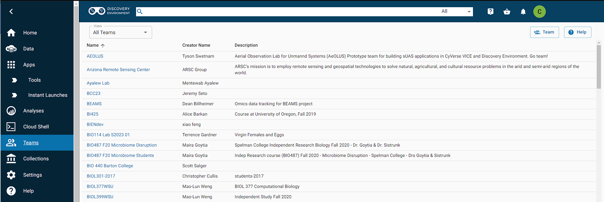
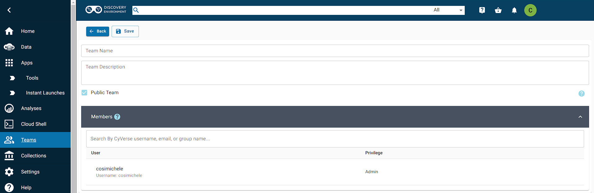
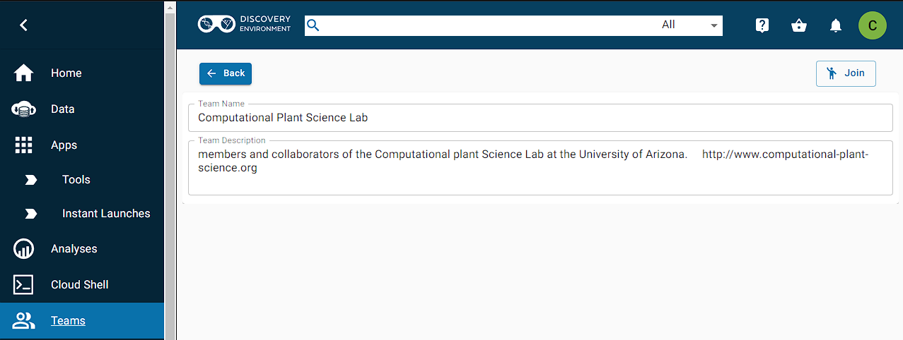
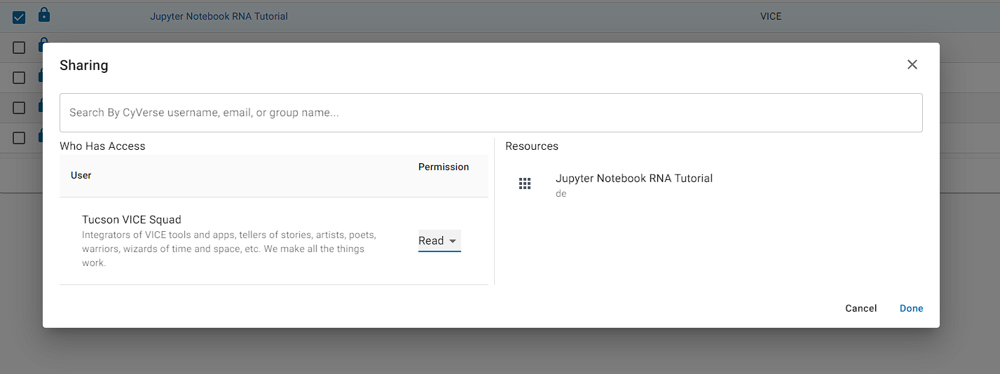

# Managing Data within a Team

[team]: ../../assets/de/menu_items/teamsIcon_2.svg

The ![team]{width=20} *Teams* feature allows you to create, organize, and join public or private groups of collaborators. Teams is accessible through the left side menu, or by going through the following link: <https://de.cyverse.org/teams>. The goal of Teams is to enable a simpler method to share apps, Tools and data with collaborators.

On the ![team]{width=20} Teams page, users are able to:

- See all public teams and teams one is part of (top left drop down menu *All Teams* :octicons-triangle-down-24:)
- Create a team (top right :fontawesome-solid-user-plus: *Team*)

## Creating a Team

To create a team, click the :fontawesome-solid-user-plus: *Team* button on the top right. This is what the Team creation page looks like:

Here, you can:

- Pick a name of your team and add a description
- Choose whether this team is public or private
- Add (or remove) members using the *Search* bar
- Choose the user's privilege level between admin or member (Admins can allow other Members to join)
- Delete the team

!!! question "What's the difference between public and private teams?"
    One can only be able to join a private team if added by the admin. Public teams allow users request to join a team through the *Join* button on the top right. Admins of that specific team will be notified.

    

!!! tip "Remember to save your changes before exiting the page!"

## Sharing Apps, Tools, and Data

Being part of a team does not mean that your apps, tools and data are automatically shared. The steps below will enable sharing of apps and tools, for example, with your team, (these steps are applicable to sharing data as well):

1. Navigate to the app or tool you want to share and select it. The app/tool should be highlighted.
1. Click the :material-share-variant: *Share* button on the top of the page. This will open the *Sharing* dialog. 
1. Use the *Search* box to look for your team.
1. Select the permission level (*Read*, *Write*, or *Own*) that you want for your team and click *Done*.

Your team should now have access to the app or tool you shared!

!!! warning "When adding a new member to an existing team, everything that has already been shared with the team will be automatically be shared with the new member. *Be careful of what you share to the team!*"

## FAQ

??? question "What happens if I delete my team?"
    If you delete your team, remove someone from your team or unshare any app, tool, or data, the app/tool/data will not be available for use by your collaborators.

??? question "What about versions?"
    Any changes you make to a shared app or tool will be reflected to the rest of the team. For example, if you add a version to an app, the team will be able to see the changes you have made.
