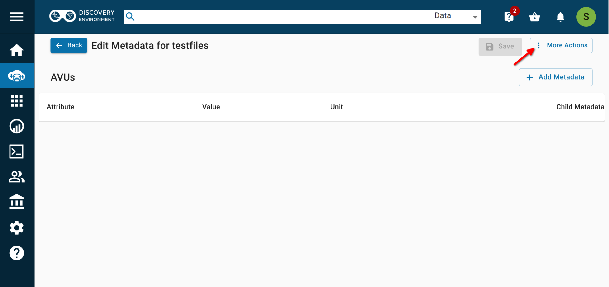
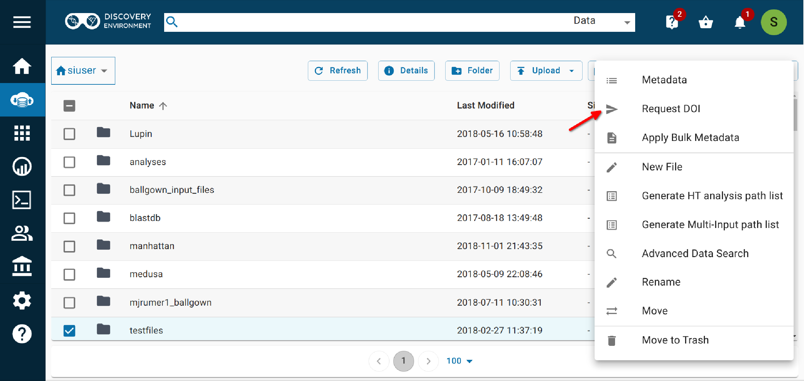

# Getting a DOI

Under our new subscription model those with 'Basic' (free) CyVerse accounts are no longer allowed DOIs. If you wish to upgrade your account please review pricing and subscription options here: https://cyverse.org/subscribe

## Background

CyVerse Curated Data in the Data Commons contains files that have been
assigned a Digital Object Identifier (DOI). These files are secure, stable, and
**unchangeable**, thus they are ideal for easy data reuse and data citation.

## DOI Request Quickstart

### 1. Organize data

#### 1.1 Create submission folder

- Organize your data so that there is one folder for each DOI (named according to the Data Commons Naming Conventions--see Step 1.2)
- Within that folder, include all files in your data package plus the ReadMe file and the inventory. 
- You may have subfolders within a data package.
- You may include compressed files in a package, as described on the [DOI Frequently Asked Questions](#doi-frequently-asked-questions), but do not compress the entire folder/package

#### 1.2. Name your top level folder according to the Data Commons Naming Conventions

CyVerse Curated Data datasets are searchable and discoverable based on their metadata.
While the dataset itself can have any name chosen by the creator (within
reason), the folder that contains the dataset must follow the naming
practices described on this page.

**General guidelines**

- Folder names must be unique.
- No invalid characters: Be sure there are **no spaces or special characters in the folder name**.
- Use underscores between each segment.

**Folder Name Format**

**\$Creator\_\$subject\_\$date**

**\$Creator:**

-   The Creator entry should be the same as entered in the Creator field
    of the DOI request - DataCite Metadata request form.
-   The Creator is the lead author, the senior author, or the
organization with the primary responsibility for the dataset. Start the
field (the creator's name) with a capital letter.

**Co-creators:**

-   If there are two co-creators, use both names, separated by an
    underscore or using camel case.
-   For three or more co-creators, select only one name or use a
    consortium name. Other contributors should be acknowledged in the
    metadata (as creators or contributors), which will display on the
    dataset landing page.

**\$subject:**

-   Very briefly describes what the dataset is about.
-   If the subject is more than one word, use either camel case
    (example: camelCase) or underscores (example:
    underscore_between_words) to separate the words.
-   If another folder has the exact same name, you may modify the
    subject slightly to maintain uniqueness.

**\$date:**

-   Either just the year, or the month and year, in which the dataset
    was created.
-   Month and year should be used only if there is likely to be more
    than one dataset with the same creator and subject within the same
    year.
-   Month must be a three-letter abbreviation: Jan, Feb, Mar, Apr, May,
    Jun, Jul, Aug, Sep, Nov, Dec

---------------------------------------------------------------------------------------------------------------------
**Examples**

#### Valid Names

-   Walls_yam_variation_2015
-   DeBarry_yamGenomicVariation_2016
-   Esteva_yam_variation_Mar2016
-   Esteva_Walls_yam_genomic_variation_Jun2016
-   YamConsortium_Dioscorea_variation_Nov2017

#### Invalid Names

-   WallsYamVariation_2016 (Missing underscore between the creator and
    the subject)
-   Esteva_yam_variation_June2016 (Month should be three letters: Jun)
-   YamConsortium_Nov2017 (No subject)
-   Walls_yam_variation_2016#1 (Contains a special character)
-   Walls YamVariation 2020 (Contains spaces)

#### Not recommended

Although the following will pass validation, they are not recommended
because the subject is too vague or too detailed:

-   Walls_variation_2016 (Subject too vague)
-   Esteva_yam_Mar2016 (Subject too vague)
-   DeBarry_yam_genetic_and_environmental_variation_with_phenotype_data_version3_Dioscorea_2016
    (Too detailed)

-----------------------------------------------------------------------------------------------------------------
#### 1.3. Create a ReadMe file

Create a text file labeled \"ReadMe\" with the following information:

-   How you obtained, organized, and labeled your dataset.

-   How to reuse the data, such as which apps can analyze the data.

-   The inventory (see Step 1.4) may be included as part of the ReadMe
    file.

-   If your data include sequences, the ReadMe should include a list of corresponding BioSample IDs.

-   Examples of good ReadMe files:

       -   https://datacommons.cyverse.org/browse/iplant/home/shared/commons_repo/curated/Carolyn_Lawrence_Dill_GOMAP_Cacao_NCBI_CriolloV2_March_2021.r1/_README.txt
       -   https://datacommons.cyverse.org/browse/iplant/home/shared/commons_repo/curated/Liang_Schnable_UNLPlantVision_2017/readMe.txt

#### 1.4. Create an inventory

You must create a plain text document that includes an inventory of the
contents of the organized dataset (at a minimum, your dataset will
contain one data file and one ReadMe file).

-   The inventory may be part of the ReadMe file or a separate file.

-   The inventory should include the ReadMe file and any other additional
non-data materials you add to your dataset.

-   If your dataset contains folders with many files (e.g., large
collections of images), you do not need to list each file in the
inventory. Simply describe the folder and what it contains.

-   Describe the file naming conventions, if that is helpful.

-----------------------------------------------------------------------------------------------------------

**Example inventory**

Lyons_DOI-Example-Aug2020:  Top level directory name
README.txt:          Plain text file that describes the origin of the data, experiments, data processing, etc.
                     Also contains a list and description for the contents of the top-level directory (unless a separate inventory file is provided)
License.txt:         License file (e.g., GPL, MIT) that governs the use of the data
a.data1/:            Directory containing data
b.data2/:            Directory containing more data
c.data3/:            Directory containing even more data

--------------------------------------------------------------------------------------------------------------

### 2. Add metadata

- You must provide all required metadata in the 'DOI Request--Datacite 4.1' template at a minimum.
- You may add any additional metadata that is appropriate. We encourage the use of additional metadata to make your data better understood and more discoverable. For more information, including how to apply metadata, see [Adding Metadata](https://learning.cyverse.org/ds/metadata/).

!!! tip

	Get recognition for your work by including [ORCIDs](https://orcid.org/) for yourself and all creators and contributors.

#### 2.1 In the Data window, click the checkbox next to the folder.

{ width="600" }

#### 2.2 Select More actions > Metadata.

{ width="600" }

{ width="600" }

#### 2.3 Select More actions (again) > View in template.

{ width="600" }

{ width="600" }

#### 2.4 Choose the 'DOI Request - DataCite4.1' metadata template.

{ width="600" }

{ width="600" }

#### 2.5 Complete the required fields (marked with an asterisk) and as many of the optional fields as possible.

{ width="600" }

!!! warning

	Be sure to include at least 3 subject key words or phrases, so that people can discover your data (Findability)! **Each subject should be in its own field** (click on the plus next to "Subject" to add a subject field. **DO NOT use a comma-separated list.**)

#### 2.6 Save the template.

{ width="600" }

### 3. Submit request and wait for validations

#### 3.1. Before you submit

Check the following to be sure everything is in order.

-   There are no spaces or special characters in your file or folder names.
-   You have included a ReadMe file that includes all the information specified in step 1.3.
-   You followed the Data Commons Naming Conventions
-   You have filled in all the required fields in the 'DOI Request - DataCite 4.1' metadata template
-   You have included at least 3 subjects in your metadata
-   Each subject is in a separate field (not comma-separated).
-   The 'description' in your metadata is adequate (other users can tell what your data describe). 
-   You understand that **once the DOI is issued you cannot change the data.** If you know your data will change you should consider waiting to request a DOI. If you do need to make changes later this DOI can be deprecated, a new DOI issued, and the two DOIs linked together as versions.

#### 3.2 Submit DOI request

**In the Data tab, click the checkbox next to the folder.**

{ width="600" }

**Select More actions \> Request DOI.**

{ width="600" }

{ width="600" }

After verifying you have read the instructions (i.e., this guide),
    click \"I need a DOI\". You will receive a verification email that
    your request has been received, and a notification will be listed in
    the Notifications list in the DE.

!!! note

	At this point, your folder will move to a new location under Community Data/commons_repo/staging.

#### 3.3. Validations

- After submitting your request, a CyVerse curator begins
    validating your dataset, metadata, and overall configuration of your
    dataset.
- Validations are based solely on the required DOI metadata and
    folder-naming conventions, as well as the data's potential utility to the
    CyVerse and larger scientific community, not the quality of your
    data. This is not a peer review process.

**Possible validation actions**

-   If the curator determines that minor changes are needed, they
        may make those changes themself.
-   If the curator determines that substantive changes are needed,
        they will contact you with required changes.
-   If the curator determines that your dataset is not appropriate
        for the Curated Data section of the Data Commons (e.g., because
        it belongs in NCBI), you will be notified.
-   If the curator determines that the dataset is adequately
        organized and the DataCite metadata are accurate, they will
        provide a DOI, and you will be notified of the DOI and the final
        dataset location.

!!! tip

	To check the status of your DOI request, click Notifications (the bell icon) at the top right of the DE screen. 

------------------------------------------------------------------------

### 4. After publication

#### 4.1. Get your dataset noticed

Metadata, the description about your data, is key to getting your dataset noticed in the world wide web. Search engines and bibliographic aggregators index the metadata that you create to obtain a DOI. Thus, it is important that you do the following:

 -   Make sure the metadata are complete.
 -   Include precise keywords in the "Subject" attribute. 
 -   Include descriptive terms about the science and themes involved in your
        research. These can go in the "Subject" attribute, but you can
        also create additional metadata attributes specific to your
        dataset.
 -   Include methods used to generate the dataset in the
        "Description" attribute, and in more detail in a ReadMe file.
 -   Describe the dataset for a broader audience so that they
        understand your research. Use the "Description" field for
        this.
 -   If you or team members have an ORCID ID, make sure to include it
        in the metadata.

#### 4.2. Publicize your dataset

-   Consider using social media to share the DOI of your dataset, and
    tag CyVerse.
-   If you have an interesting story about your data, contact us at
    <learning@cyverse.org>, and we may be able to share it through CyVerse
    outreach.
-   If you have a tool or workflow you developed to analyze your data in
    CyVerse, consider presenting it as part of our CyVerse Webinars.

------------------------------------------------------------------------

## DOI Frequently Asked Questions

**Why should I publish my data in CyVerse Curated Data?**

CyVerse Curated Data is the ideal platform for ease of data reuse.
Because it is assigned a permanent identifier (DOI), it is stable
and unchangeable, making it ideal for data citation. Because the data is
stored in large-scale storage resources that are monitored 24/7, it is
secure. Because it allows transfer, upload, and download across
different computers and platforms, it can store very large datasets. And
because its data is accessible to CyVerse's suite of large-scale
computational analysis resources, users can seamlessly analyze, manage,
and publish new results. For more information, see [Is CyVerse Curated
Data Right for My Data?](#rightformydata).

**What are the conditions for data to be published through CyVerse Curated Data?**

Several conditions must exist in your data before it can be published in
CyVerse Curated Data:

-   You must be a registered CyVerse account holder. To register for an
    account, see the [Create Account
    Quickstart](https://learning.cyverse.org/account/).
-   A dataset may be up to 100GB in size. If you are interested in
    depositing a larger dataset, please request an increased data
    allocation before requesting a permanent identifier using [this
    form](https://user.cyverse.org/administrative/forms/2).
-   Data must be both curated and static. Once the data is published, it
    cannot be amended (although newer versions can be published).
-   Data must be organized to identify the different components (raw,
    preprocessed, analysis, etc.).
-   Compressed files must be in LASzip (<https://www.laszip.org/>) or open-source [Gzip](http://en.wikipedia.org/wiki/Gzip) family of
    compression formats including zip, tar, tar.gz, or tgz.
-   At minimum, the dataset must include a complete description
    according to the [DataCite standard](https://schema.datacite.org/).
    Domain-specific schemas, however, and the addition of ReadMe files,
    publications, or help notes that explain the data as well as how
    they were obtained and can be used, are encouraged. In organizing
    and documenting the data, users should ask themselves, "What would
    someone need to reuse this data?"

**Can I publish to the Data Commons if my data is not static and curated by CyVerse?**

Yes, you can make data available to the public via Community Released
Data. You can request a community release data folder using [this form](https://user.cyverse.org/administrative/forms/7).

**What is a DOI?**

A DOI is a [Digital Object Identifier](https://www.doi.org/index.html). It is a permanent, redirectable
identifier and URL for your dataset, so that even if the location of
your dataset changes, it can still be found with the same ID. DOIs are
issued by CyVerse through the [DataCite](https://datacite.org/){.title-ref}\_ service.

**Do I need to contact CyVerse before requesting a DOI?**

The process of requesting a
DOI is automated through the DE, but some tasks must be handled
manually, such as DOIs for datasets with more than 1000 files or DOIs
for datasets that are stored somewhere other than
/iplant/home/share/commons_repo/curated. If you match either of those
cases, please contact us at <doi@cyverse.org>.

Also contact us if you have questions about how to organize your data or
what scientific metadata to include.

**How much does a CyVerse permanent identifier cost?**

At this time,
CyVerse does not charge for DOIs. However, the dataset must meet the
requirements given on the page [Is CyVerse Curated Data Right for My
Data?](#rightformydata).
In the future, there may be a charge for issuing permanent identifiers
in the CyVerse Data Commons.

**How long will it take to obtain a permanent identifier and publish my
data?**

Provided that your dataset is in good order and ready to be published,
the process may take up to one week, as it may involve a dialogue with
the CyVerse data curators. If your data is well organized and the
metadata is complete and accurate, the process will be much faster
(usually 1-2 business days). It is best to submit your request at least one week
before you need the identifier (e.g., for a manuscript submission) or
more for very large of complex datasets.

**Can I publish different versions of my data?**

Yes. Each new version must be documented, and will be assigned a new
permanent identifier that references the original dataset. For new
versions, contact us at <doi@cyverse.org>.

**How small or big should my data be to be published?**

The size of the dataset is
less important than its utility to the scientific community. Although
there is no lower size limit for requesting a DOI, the default
upper size limit for data allocations on CyVerse is 100GB. If you are
interested in depositing a larger dataset, please request an increased
data allocation before requesting a permanent identifier.

**Determine what to include**

A data collection may be composed of multiple files and different
datasets. In preparing your data for publication identify the data and
other materials that you consider useful for validation and reuse of
your research:

-   Data associated to a research project may include multiple files
    with different roles.
-   If there are components of your dataset that belong in a public
    repository such as NCBI (e.g., fastq files), submit them to the
    repository, rather than to CyVerse Curated Data. You may want to
    include a list of external files in your dataset, with links.
-   Beyond data, you will include the ReadMe file (see Step 1.3), and
    you may include scripts or links to scripts to run your analysis.
    Links to analysis tools can also be included as metadata (see Step
    2).

**Determine how many permanent identifiers to request**

To determine how many DOIs to request for a given data collection,
consider the following:

-   Size and number of components.
-   How many studies or publications does it represent?
-   Is your data collection formed by different datasets and are those
    likely to be used separately?
-   Do you want to create a data collection with one DOI for the entire
    project and additional related DOIs for distinct datasets so that
    they are cited individually? DOIs can be nested, so that one dataset
    is part of another.
-   If you are uncertain about how many DOIs to request, contact us at
    <doi@cyverse.org>.

**What is the policy for submitting compressed data to CyVerse Curated Data?**

Certain file types are regularly transferred, stored, and used in
applications in a compressed form, such as FASTQ for genomic data and
LAZ for LIDAR data. Curated Data supports the deposition of files in the
following open compressed formats: LASzip (<https://www.laszip.org/>) and
the open source Gzip (<http://en.wikipedia.org/wiki/Gzip>) family of
compression formats including zip, tar, tar.gz, or tgz.

**Can I publish data in CyVerse if I am not a CyVerse user?**

You must have a CyVerse
account to publish your data in the Data Commons repositories (Community
Contributed or Curated Data). You do not have to be a user of the entire
platform, but at minimum you must be able to upload data, add metadata,
and use the Discovery Environment to request a DOI. If you have not used
the DE's metadata features before, start with [Using Metadata in the
DE](https://wiki.cyverse.org/wiki/display/DEmanual/Using+Metadata+in+the+DE)
and read the section on metadata templates.

**How secure is the data in the Curated Data site?**

Data in our platform is
stored in large-scale storage resources that are monitored 24/7. Data is
authenticated through checksum analysis at ingest, and is locally and
geographically replicated so that if any one system fails there will
always be a safe copy of your data.

**What is CyVerse Data Commons' long-term commitment to hosting public data?**

If and when the Data
Commons cannot host your data in CyVerse Curated Data, it will transfer
custody of the data to another repository and will change the target URL
to which the identifier points.

**What if in the future I want to move my data to another repository?**

If you want to move your
data to another repository, please send a ticket with the new DOI and
URL location and we will change the DOI target. You may leave a copy of
the dataset in the CyVerse Curated Data site for ease of reuse within
the computational environment. CyVerse will update the metadata to reflect
the relationship between the two identical datasets.

**How can I make it easier for people to give me (and my co-creators) credit for using my dataset?**

Encourage others to cite your data using the DOI. Each dataset landing
page includes a citation that can be copied or downloaded in standard
formats (BibTEX or EndNote).

Connecting your data to your ORCID (see <http://orcid.org/>) also
ensures that you get credit for your work. ORCID provides a persistent
digital identifier that distinguishes you from every other researcher
and supports automated linkages between you and your professional
activities, ensuring that your work is recognized. The DataCite metadata
template includes places to list ORCIDs of the creator. The DOI creation
metadata template has a place for ORCIDs of creators and contributors.

If you have published a paper that goes with your data, be sure to cite
the DOI in the paper. Provide a link to the paper's DOI in the metadata
under "relatedIdentifier".

If your data include specific instructions for citing or reuse, to
provide those in the ReadMe file and (if brief) in the
\"reuse_or_citation_conditions\" metadata field.

**Whom do I choose for the creator versus contributor?**

Creators are the main
researchers involved in producing the data, or the authors of the
publication, in priority order. To supply multiple creators, repeat this
property. A creator may be a corporate/institutional or personal name; it
does not need to be the person who is submitting the identifier request.

A Contributor is the institution or person(s) responsible for collecting, managing,
distributing, or otherwise contributing to the development of the
resource. To supply multiple contributors, repeat this property. For
software, if there is an alternate entity that "holds, archives,
publishes, prints, distributes, releases, issues, or produces" the
code, use the contributorType "hostingInstitution" for the code
repository.

You must include the role of all contributors. Choose from the dropdown
list in the DOI request template.

**Which license can I use to publish my data?**

You can choose one of two open source licenses, depending on the
materials you will be publishing:

   - ODC PDDL for non-copyrightable materials (i.e., data only).

   - CC0 for copyrightable material (Workflows, White Papers, Project
Documents). If you have special circumstances that require a different
license (e.g., your dataset is aggregated from previously published data
that already has another license), please contact us at
<doi@cyverse.org>.

**What metadata standards does CyVerse support for data publication?**

All data will follow
the DataCite metadata schema (currently using version 4.1). However,
DataCite metadata is citation metadata that does not represent the
complexity of the research that went behind creating your data.
Therefore, we encourage you to include additional metadata. We suggest
that you include the metadata records and other help documents in your
publication package within a folder labeled as "metadata" so it is
easily identifiable for other users. Consider taking advantage of the
DE's bulk metadata application feature for adding file level metadata,
especially for large datasets.

**What if I want to change or add metadata to my public data?**

If you need to make changes
to the metadata of a dataset with a DOI, contact us at
<doi@cyverse.org>. If your dataset is connected to a paper that is
published after the DOI is created, please contact us with the paper\'s
DOI so we can link it in the metadata.

**Where can I go for help on permanent identifiers?**

Email the [CyVerse DOI
team](mailto::doi@cyverse.org).

---------------------------------------------------------------------------------------------------------------------

## Is the CyVerse Curated Data Repository right for my data?

**Before requesting a permanent identifier in CyVerse Curated Data
through the Data Commons**, answer the following series of questions.

**Question 1. Do you have a CyVerse account?**

-   Are you a registered CyVerse user? If not, register at [CyVerse User Portal](https://user.cyverse.org/).
-   If so, have you used the Discovery Environment (DE)?
-   The tools for submitting data to Data Commons Curated Data are
    simple to use and available as part of the DE. At a minimum, you
    should be able to upload and organize your data using the DE or command-line tools,
    and be able to apply a template.

**Question 2. Is your data ready for publication?**

-   Is the dataset complete, stable, and ready for public consumption?

-   Are you and all contributors to the dataset prepared to move the data
into the public domain (meaning that anyone can access and use the data
for any purpose, including commercial purposes)? Have you sufficiently
documented how the data was created such that other scientists in your
field will be able to reuse it? 
-   If there is a standard or commonly
used format for your datatype, is your data in that format? If no
standard exists, is your data in a format that can be easily used by
most people with open source software (e.g., tables as a CSV or text
file, rather than a Microsoft Excel spreadsheet)? 
-   Is your data
organized in a clear and reasonable structure that others will be able
to understand? 

If you answered no to any of these questions, your
dataset is not yet ready for a permanent identifier through Data Commons
Curated Data. Please continue to work on your dataset until it meets
these requirements. Data will be reviewed by a curator to ensure that it
meets these requirements.

If you would like to make your data public, but it is not complete
and/or stable, you may request data hosting in the Data Commons.

**Question 3. Is your data suitable for reuse in scientific analyses?**

-   Is your data of the type and format that allow it to be reused in
    other analyses?
-   Are you prepared to supply metadata for your dataset?
-   Does your dataset or metadata include sufficient instructions (e.g.,
    a Readme file) such that someone in your field can understand how to
    reuse the data?

**Question 4. Is there a canonical repository for your data?**

-   Does a canonical repository exist for your data? Examples include
    NCBI, EBI, and MG-RAST.
-   If a canonical repository exists, you should use it. CyVerse is
    there to help fill a gap, not replace an existing resource.

**If you answered No**

-   If you answered No to **any** of the questions above, your data may be
    suitable for a DOI, but not through Data Commons Curated Data. You
    should consider other repositories that are not geared specifically
    toward data analysis, such as your institution's library.

!!! tip

	If your data was generated by or was input for an analysis algorithm or software that you developed yourself, please consider making the method available through CyVerse infrastructure (e.g., the Discovery Environment or Atmosphere) as well.

