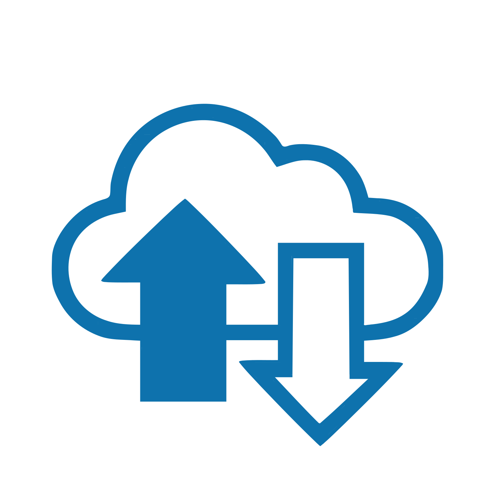
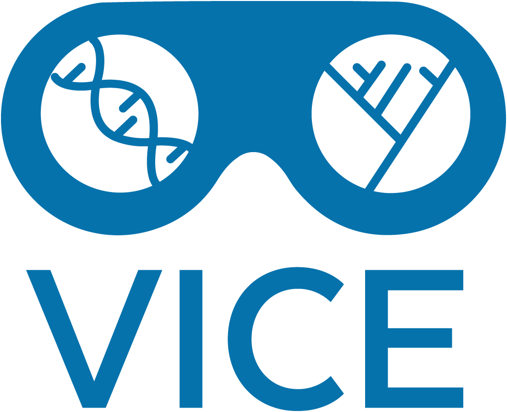

# Manage Your Data with the Data Store

<figure markdown>
  { width="200" }
</figure>

The CyVerse Data Store is a platform for storing, managing, and sharing your data across the full data lifecycle. The Data Store crosscuts, and is accessible from, all CyVerse platforms. Data Store features are designed to help you follow a number of practices to ensure that the integrity and value of your data are maintained and to make your data more FAIR (Findable, Accessible, Interoperable, and Reusable) with less effort. 

This guide will cover the minimum needed to get you started. It assumes you have created a CyVerse account already. 

---

### Table of Contents

1. [Move Data](move_data)
    - [Transfer Data with Discovery Environment](../de/manage_data)
    - [Transfer Data with Cyberduck](cyberduck)
    - [Transfer Data with iCommands on Command Line](icommands)
    - [Transfer Data with GoCommands on Command Line](gocommands)
    - [HTTP(S) Access with WebDAV](webdav)
    - [Transferring Data with SFTP](sftp)
2. [Add Metadata](metadata)
3. [Share Data](share)
4. [Get a DOI](doi)
5. [Check Data Storage Quotas](check_data)
6. [Managing Data within a Team](teams)

---

## [{width=30} Moving Data](move_data)

Learn how to move data to and from the CyVerse Data Store efficiently. This section covers various methods and tools you can use to transfer your data.

## [{width=25} Data Management with Discovery Environment](../de/manage_data)

Explore the Discovery Environment (DE) for managing your data. This graphical user interface allows you to perform a variety of data management tasks without the need for command-line knowledge.

## [:material-duck: Transferring Data with Cyberduck](cyberduck)

Cyberduck is a popular open-source client for transferring files. This section provides step-by-step instructions on using Cyberduck to transfer data to and from the CyVerse Data Store.

## [:octicons-terminal-16: Transferring Data with iCommands and Command Line](icommands)

For advanced users, iCommands offer a powerful way to manage data via the command line. Learn how to install and use iCommands for efficient data transfers and management.

## [:simple-go: Transferring Data with GoCommands and Command Line](gocommands)

GoCommands provide another command-line tool for data transfer. This section explains how to set up and use GoCommands to interact with the CyVerse Data Store.

## [:material-web: HTTP Access with WebDAV](webdav)

WebDAV allows you to access the CyVerse Data Store over HTTP. Discover how to configure and use WebDAV for seamless data access and management.

## [:material-play-network: Transferring Data with SFTP](sftp)

Secure File Transfer Protocol (SFTP) is a secure method for transferring data. Learn how to use SFTP to move your data to and from the CyVerse Data Store.

## [:octicons-list-unordered-16: Adding Metadata](metadata)

Metadata is crucial for data organization and retrieval. This section covers how to add and manage metadata for your data stored in the CyVerse Data Store.

## [:material-share-variant: Sharing Data](share)

Collaboration is key in research. Learn how to share your data with colleagues and collaborators securely using the CyVerse Data Store.

## [:simple-doi: Getting a DOI](doi)

A Digital Object Identifier (DOI) provides a permanent link to your data. Find out how to obtain a DOI for your datasets stored in the CyVerse Data Store.

## [Checking Data Storage](check_data)

Keep track of your data usage and storage limits. This section provides tools and tips for monitoring your data storage in the CyVerse Data Store.

## [{width=25} Teams](teams)

Manage team access and permissions for your data. Learn how to create and manage teams within the CyVerse Data Store to facilitate collaborative work.

We hope this documentation helps you in managing your data effectively. If you have any questions or need further assistance, please refer to our support resources or contact us directly.

## Internal Documentation

For internal documentation, please see the [Data Store Manual](https://cyverse.atlassian.net/wiki/spaces/DS/overview) for a more comprehensive look at Data Store capabilities.
