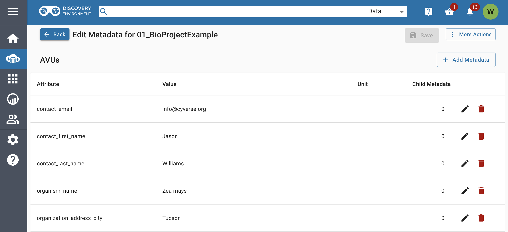

[Learning Center Home](http://learning.cyverse.org/)

# Adding Metadata to Data

CyVerse supports a variety of solutions that allow you to
associate your raw data with metadata. Metadata is critically
important to quality research (see this article on [FAIR Principles](https://www.nature.com/articles/sdata201618)), yet it is often
an afterthought until you are ready to publish and share. Here
are a few metadata features in CyVerse that you should know about and can adopt at the
outset.

**Some things to remember about the CyVerse Discovery Environment**

-   You can add metadata to a single file/folder, or in bulk to large
    collections of data. 
-   You can use your own metadata schema or apply one of several metadata templates supported in the Discovery Environment.
-   Additional templates you may wish to use can be found at resources like [FairSharing.org](ttps://fairsharing.org/).
-   Metadata can be managed through the DE's graphical user interface or by using iCommands at the command line. 
-   This guide only covers metadata options in the Discovery Environment.

------------------------------------------------------------------------

## Viewing and Editing Metadata for a Single File/Folder in the Discovery Environment

!!! Note

    You must have *write* or *own* permission to
    edit an object's metadata.

1.  Log into the [Discovery Environment](https://de.cyverse.org/de/).
2. Click on the { width="25" }  (Data Icon) to view or browse data. Select (checkbox) a single file/folder for which you want to add metadata.
3. Under the **More Actions** menu, click on **'Metadata'**. You will see existing metadata for the file/folder in the Attribute, Value, Unit (AVU) format.

??? Tip

    A single piece of metadata, or an AVU, is made up of attributes,
    values, and units. An attribute is a changeable property or
    characteristic of the file or folder you have selected that can be
    set to a value. For example, "time point" might be an attribute
    of a file, while '7' could be its value, and "hour" a unit of the time point.
    

**Adding metadata**

1.  Click the "+ Add Metadata" button to add a new entry. Then follow
    the directions for editing metadata below.

**Editing or deleting metadata**

1.  You may use the "pencil" icon to edit an existing entry or the
    "trash can" icon to delete an entry.
2.  After you have made edits or deletions, click 'Save' to save all entries and apply the metadata.

------------------------------------------------------------------------

## Adding Metadata to Multiple Files/Folder in the Discovery Environment

**Adding Metadata using a CyVerse Template**

1.  Log into the [Discovery Environment](https://de.cyverse.org/de/).

2.  Click on the { width="25" } (Data Icon) to open a Data window. Select (checkbox) a single file/folder to which you want to add metadata.

3.  Under the **More Actions** menu, click on **Metadata**. Click on
    the subsequent **More Actions** menu and select **View in
    Template**. You have two choices in using the template:

     **A.** Choose a template; clicking **Select** will allow you to apply the template and edit the metadata manually in the DE interface.  
     **B.** Clicking the { width="25" }(Download icon) will download a .csv file you can edit and upload (see Applying bulk metadata below).

    Click *OK* to download. (In this example, we will use
    the *DOI Request - DataCite Metadata*) template.

**Editing a metadata template in the DE**

Follow the steps in the "Editing or deleting metadata" from the section above.

**Editing a downloaded metadata template**

1.  Unzip the downloaded template; it will contain two files
    *blank.csv* and *guide.csv*. Open these
    files using the spreadsheet editor of your choice.

??? Tip

        -   *blank.csv* is the metadata template that you will
            complete for your data.
        -   *guide.csv* contains instructions for your template,
            and will usually include controlled vocabulary terms for
            metadata descriptors.

2.  Edit the template in one of two ways:

    -   *If all data will be in a single folder*

       1.  In the *blank.csv* spreadsheet, in the *'file name or path'* column, enter the file names of all the files/folder in that folder you wish to annotate with metadata.
        
??? Tip 

        1.  In any data window, click the **⋮** (3-dots or ellipsis menu) next
            to any file or folder; choose **copy path** to get the path to
            that item in the Data Store.
        2.  In the remaining columns of the template, enter the values for
            each file/attribute combination that applies.
        3.  If desired, add additional columns to the end of the template.
            The metadata in the additional columns will be saved in the
            Data Store but will not be stored as part of the template.
        4.  Save the file in **CSV format**. Avoid using spaces or specal characters
            when naming the file or parent folder. You may name this metadata file anything you wish,
            but keep it in CSV format (i.e., [filename].csv).

    -  *If data will be in multiple folders*

      1.  In the *blank.csv* spreadsheet, in the *'filename or path* column, enter the full path of the top-level folder (e.g., `/iplant/home/YOURUSERNAME/FOLDERNAME`) 
        2.  In the remaining columns in the first row, enter the values
            for each file/attribute combination
        3.  Repeat for each file, making sure to add the full file path
            (e.g., `/iplant/home/YOURUSERNAME/FOLDERNAME`) for
            each file.
        4.  If desired, add additional columns to the end of the template.
            The metadata in the columns will be saved in the Data Store
            but will not be stored as part of the template.
        5.  Save the file in **CSV format**. Avoid using spaces or specal characters
            when naming the file or parent folder. You may name this metadata file anything you wish,
            but keep it in CSV format (i.e., [filename].csv).

3.  In an open 'Data' window in the Discovery Environment, navigate to the
    appropriate location for uploading the template:
    -   If the first column of your metadata file contains only file
        names (i.e., all data files are in the same folder), navigate
        to the folder and use the **Upload** button (Browse local) or
        your choice of upload tool to upload the metadata (csv file) to
        that folder.

    -   If the first column of your metadata file contains the full path
        to each file (i.e., the data files are in different folders),
        it does not matter where the metadata file is located on the
        Data Store. Use the **Upload** button (Browse local) or your
        choice of upload tool to upload the metadata (csv file) to an
        appropriate location on the Data Store.

        ??? Tip
        
            For convenient management and editing, use absolute file paths
            (e.g., `/iplant/home/your_file_location`) so that all of your metadata spreadsheets 
            will be in one location on the Data Store.
        
4.  To apply the metadata, in the Data window, select (checkbox) the
    name of the **folder** containing the data files to which you want
    to apply the metadata in bulk.
5.  Click the **More Actions** menu, select 'Apply Bulk Metadata';
    browse to the uploaded metadata spreadsheet and select it.

Your metadata should now be applied to your files. You should receive a
notification (bell icon) in the Discovery Environment and you can confirm the
metadata have been correctly applied by following the steps in the
preceding section to view metadata.

------------------------------------------------------------------------

**Fix or improve this documentation**

-   Search for an answer: [CyVerse Learning Center](https://cyverse-learning-materials.github.io/learning-materials-home)
-   Ask us for help: click the Intercom icon { width="25" } on the lower right-hand side of the page
-   Report an issue or submit a change: [Github Repo](https://github.com/CyVerse-learning-materials/data_store_guide)
-   Send feedback: [learning@CyVerse.org](learning@CyVerse.org)

------------------------------------------------------------------------
