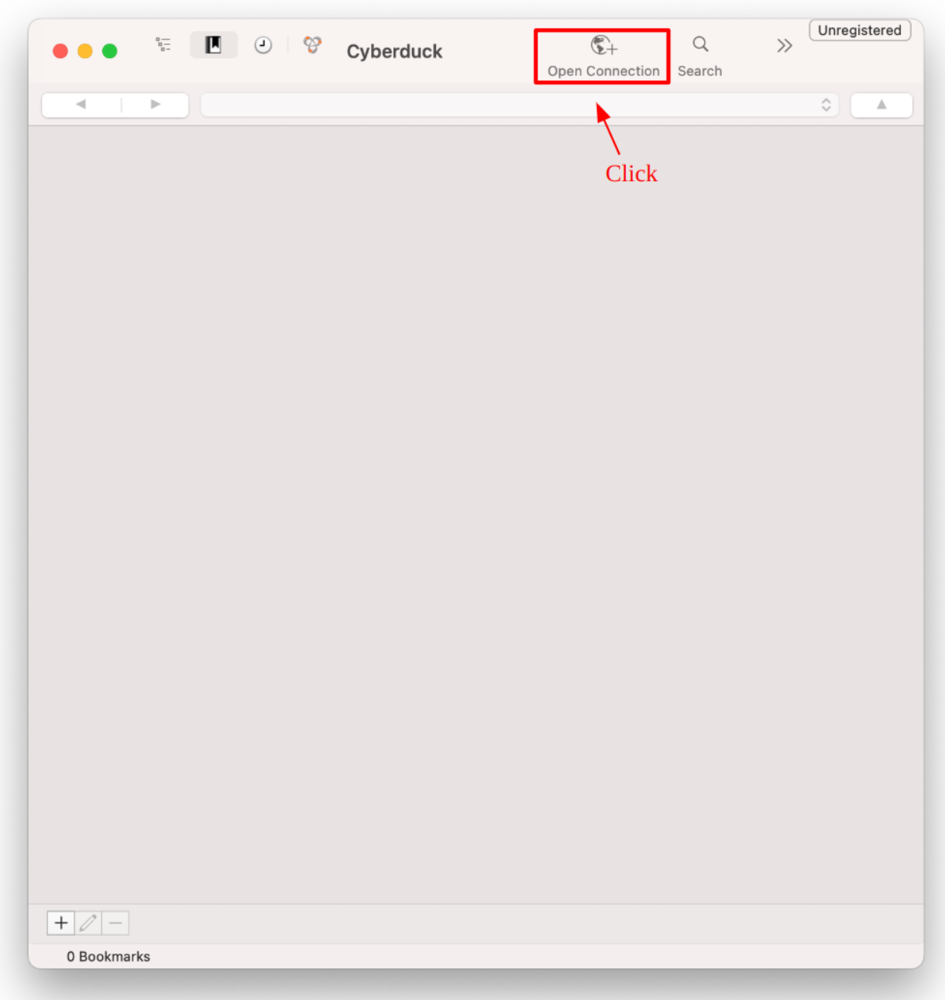
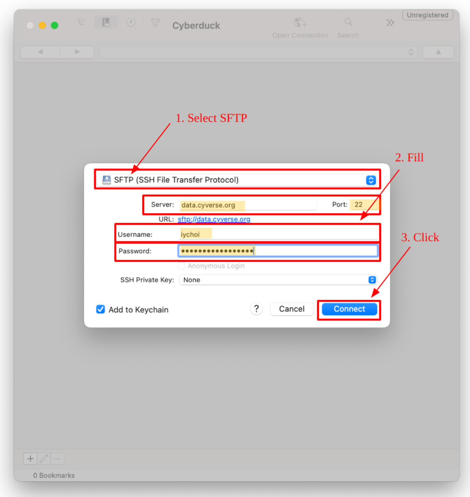
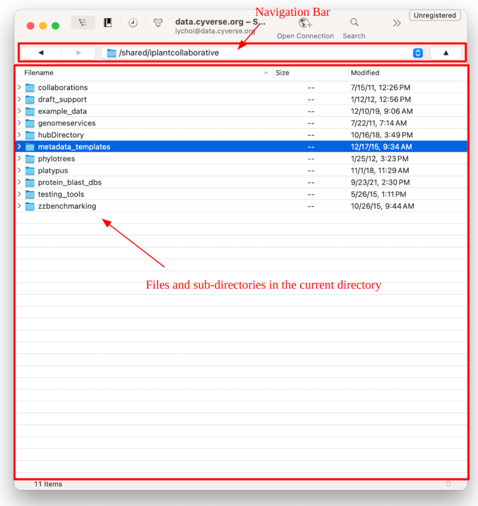
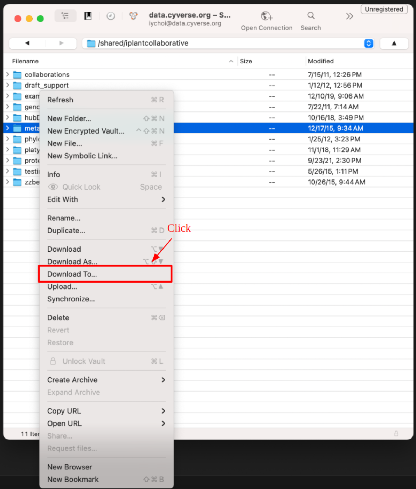

# SFTP Access using Cyberduck

Cyberduck is a free, open-source GUI FTP client available for both Windows and macOS. It supports various protocols such as FTP, SFTP, and WebDAV, allowing you to access the Data Store and other cloud storage services like Amazon S3, Google Drive, and Dropbox.

This guide demonstrates how to use Cyberduck for SFTP access to the Data Store.

## :material-cog-outline: Installation

To install Cyberduck, follow these steps:

1. **Download Cyberduck:**
    Visit the [Cyberduck website](https://cyberduck.io/download/) and download the appropriate version for your operating system (Windows or macOS).

2. **Install Cyberduck:**

    - **Windows:** Double-click the downloaded `.exe` file and follow the installation wizard.
    - **macOS:** Double-click the downloaded `.zip` file to extract the contents. Open the extracted folder and find the `Cyberduck.app` icon. Drag and drop this icon into your Applications folder.

3. **Launch Cyberduck:**
    After installation, launch the Cyberduck to start using it.

---

## :material-play-network: Connect to the Data Store

{ width="600" }

In the Cyberduck window, click **Open Connection** button to create a new profile.

{ width="600" }

In the popup window, fill in the following fields:

- **Protocol:** `SFTP (SSH File Transfer Protocol)`
- **Server:** `data.cyverse.org`
- **Port:** `22`
- **Username:** `<CyVerse username>`
- **Password:** `<CyVerse password>`

Use these credentials for anonymous access to the Data Store:

- **Username:** `anonymous`
- **Password:** (leave empty)

Click the **Connect** button to establish the connection.

---

## :material-play-network: Basic Usage

**To navigate:**

{ width="600" }

- Click on directory names to move into folders
- Click the top drop-down box and click directory name to move out of folders

**To transfer files:**

{ width="600" }

1. Select the desired files or directories
2. Right-click on the selected items and choose `Download To...` from the context menu

> **Note:** Additionally, you can utilize the drag-and-drop feature to easily upload files and directories from your local system to the Data Store, and vice versa.

---

## :material-play-network: Top-level Directories

Once connected, you will see two directories in the root:

- `<username>`: Your home directory (`/iplant/home/<username>` in the Data Store). You have read and write permissions. Note that anonymous users do not have a home directory.
- `shared`: Community-shared data directory (`/iplant/home/shared` in the Data Store). You have only read permission.

> **Note:** A `.ssh` directory may appear in the root, but it is not writable. This directory is distinct from the `/<username>/.ssh` directory and should be ignored.