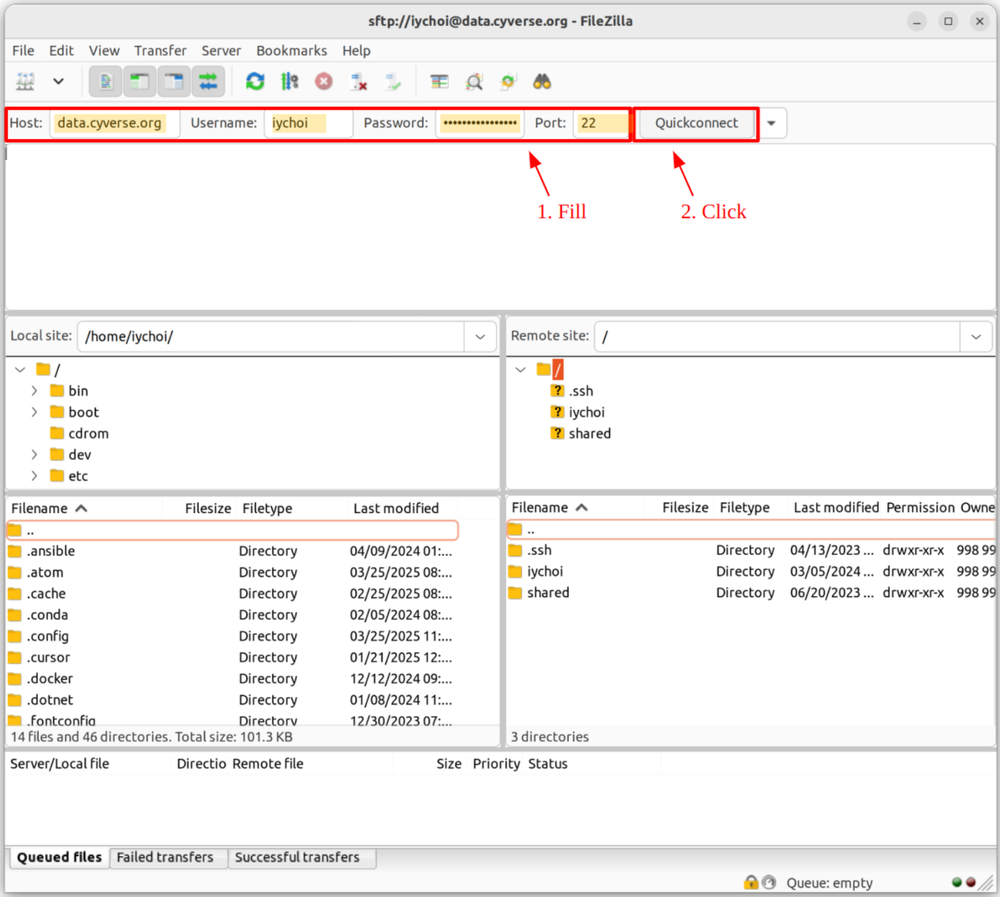
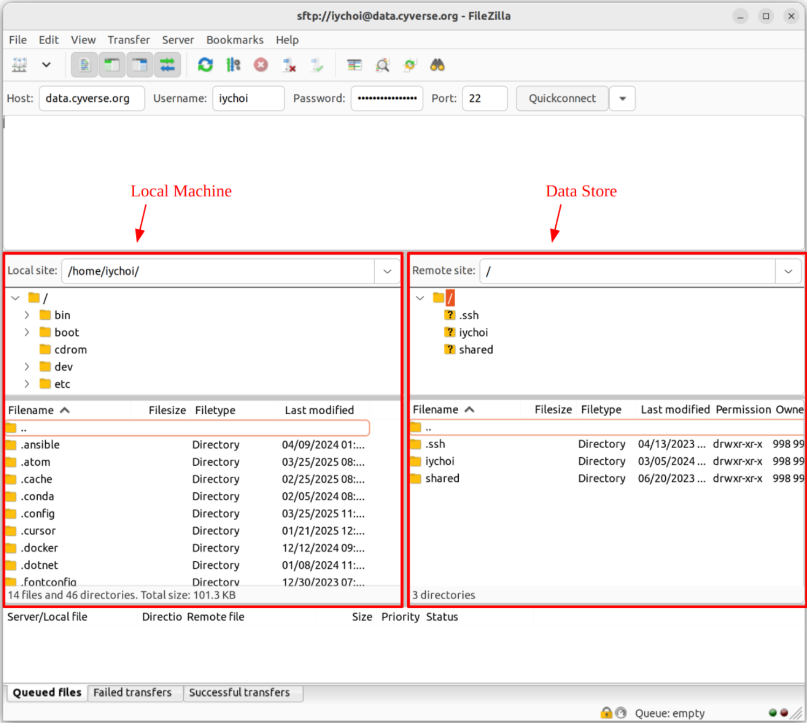

# SFTP Access via FileZilla

FileZilla is a free and open-source, cross-platform GUI FTP software, consisting of FileZilla Client and FileZilla Server. The FileZilla Client is available for Windows, Linux, and macOS, allowing you to access the Data Store.

## :material-cog-outline: Installation

To install the FileZilla Client, follow these steps:

1. **Download FileZilla Client:**
    Visit the [FileZilla website](https://filezilla-project.org/download.php?type=client) and download the client version suitable for your operating system (Windows, Linux, or macOS).

2. **Install FileZilla:**

    - **Windows:** Double-click the downloaded `.exe` file and follow the installation wizard.
    - **macOS:** Open the downloaded package and drag the FileZilla application to your Applications folder.
    - **Linux:** Use your distribution's package manager to install FileZilla. Alternatively, you can compile it from source if necessary.

3. **Launch FileZilla:**
    After installation, launch the FileZilla Client to start using it.

---

## :material-play-network: Connect to the Data Store

In the FileZilla window, fill in the following fields:

- **Host:** `data.cyverse.org`
- **Username:** `<CyVerse username>`
- **Password:** `<CyVerse password>`
- **Port:** `22`

Use these credentials for anonymous access to the Data Store:

- **Username:** `anonymous`
- **Password:** (leave empty)

Click the **Quickconnect** button to establish the connection.

{ width="600" }

---

## :material-play-network: Basic Usage

{ width="600" }

The FileZilla interface is divided into two main sections:

- **Left section:** Show data on your local machine
- **Right section:** Display data in the Data Store

**To navigate:**

- Click on directory names to move in and out of folders

**To transfer files:**

1. Select the desired files or directories
2. Drag them to the target directory in the opposite panel
3. Drop to initiate the transfer

This drag-and-drop functionality allows for easy file movement between your local system and the Data Store.

---

## :material-play-network: Top-level Directories

Once connected, you will see two directories in the root:

- `<username>`: Your home directory (`/iplant/home/<username>` in the Data Store). You have read and write permissions. Note that anonymous users do not have a home directory.
- `shared`: Community-shared data directory (`/iplant/home/shared` in the Data Store). You have only read permission.
