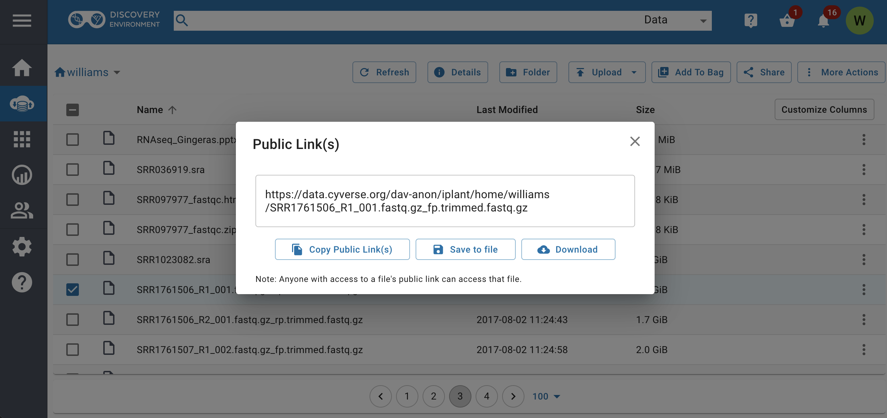
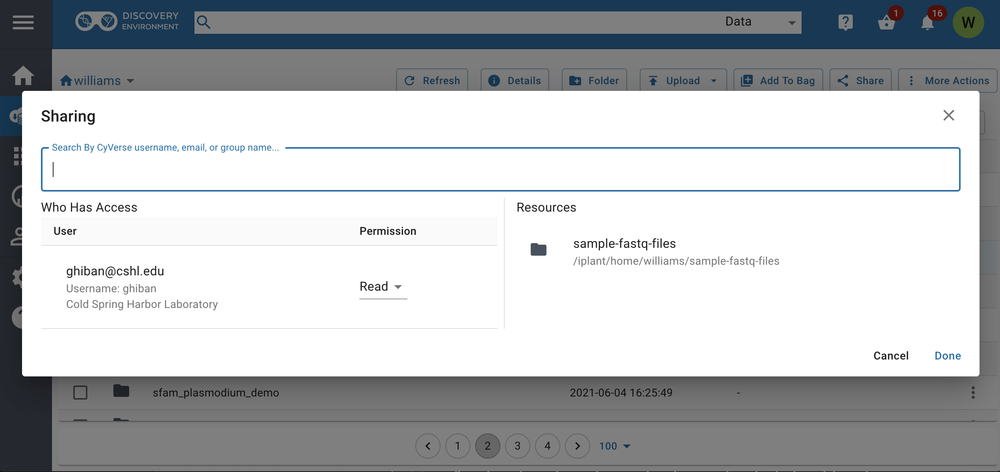

# Sharing Data

One of the most powerful features of the Data Store is the ability to share all of
your data instantly with fine-grained permission control. You can
share your data with other CyVerse users, and you can also make data
available to anonymous users and with identifiers (i.e., a DOI)
through the CyVerse [Data Commons](https://wiki.cyverse.org/wiki/display/DC/Data+Commons+Home). This guide covers the most basic, commonly used sharing features of the Discovery Environment and Data Store.

------------------------------------------------------------------------

## Share a File in the Discovery Environment with a URL (Public Link)

You can quickly share files in your Data Store using a Discovery
Environment Public Link.

!!! Note

    You can **only share individual files** using the public link. Since
    files are shared over HTTP, this is only recommended for small files.
    This is a convenient but less secure method for file transfer. Do not
    share sensitive/private data using these public links.

??? Tip

    You can use this method to view files, for example in a genome browser.

1.  If necessary, login to the [Discovery Environment](https://de.cyverse.org/de/).

2.  In the Data window, select (checkbox) one or more individual file(s)
    (not folders) you wish to share.

3.  From the *More actions* menu, select *Public Link(s)*.

4.  A new URL will be provided for you in a pop-up. Highlight and copy
    or click on Copy in order to get a window that will
    allow you to copy the URL to your clipboard. Anyone you share
    this link with will be able to download the file. You can test the
    link in a new web browser window.

    

    ??? Tip

        You can quickly create a link to a file by clicking the "3 dots" (ellipsis)
        icon next to any file and selecting "Public Link".

*To deactivate a public link:*

1.  To deactivate a link, select (checkbox) one or more individual file(s)
    that have been shared with a public link; then click on the *Details*
    menu.
2.  In the Details menu under the *Permissions* tab, click the
    "pencil" icon next to "cyverse-anonymous@cyverse.org" to edit
    the file's permissions.

------------------------------------------------------------------------

## Share a File/Folder in the Discovery Environment with Another CyVerse User

You can share data with another CyVerse user by granting them permission to read,
write, or own files/folders.

1.  If necessary, login to the [Discovery Environment](https://de.cyverse.org/de/).

2.  In the Data window, select (checkbox) file(s) or folder(s) you wish to
    share with another user; then under the *Share* menu, enter the
    CyVerse username, email, or group name you wish to share with.

3.  Next, under 'Permissions' choose which permission to grant to
    the recipient(s) you are sharing this file or folder with.

    

4.  Once you are finished, click Done to begin sharing. The user will be
    notified that a file has been shared with them.

    ??? Tip

        You can share several files/folders at once by selecting them and
        then clicking the "Add to Bag" button in the Data window and then sharing the bag.

    !!! Hint

        By managing access to data, the DE allows you to share large
        datasets instantaneously. Data permissions (based on UNIX
        permissions) are described in this chart:

        | Permission level | Read | Download/Save | Metadata | Rename | Move | Delete |
        | :---: | :---: | :---: | :---: | :---: | :---: | :---: |
        | Read | **X** | **X** | **View** |                      
        | Write | **X** | **X** | **Add/Edit** |
        | Own | **X** | **X** | **Add/Edit** | **X** | **X** | **X** |

