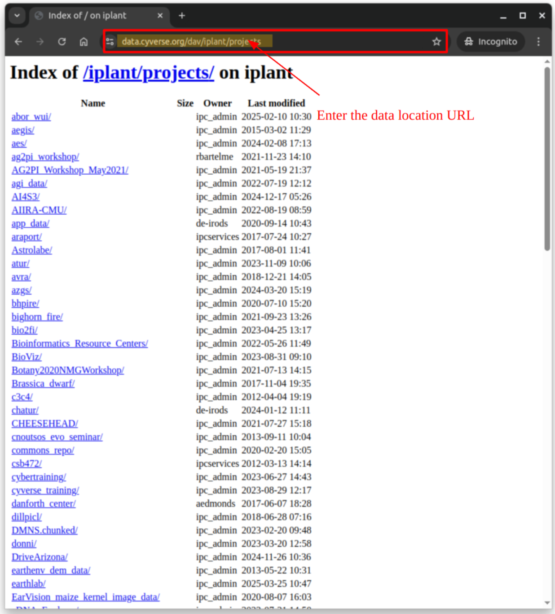
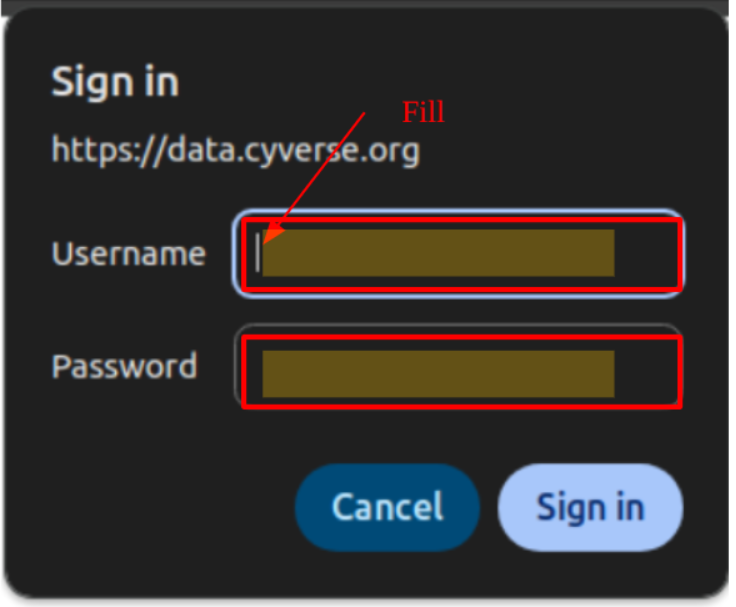

# WebDAV Access using Web Browsers

WebDAV, an extension of HTTP, allows browsing and downloading data directly through any web browser.

## :material-google-chrome: Connect to the Data Store

In your web browser, enter the URL of the data location.

{ width="600" }

If the data requires authentication, you will be prompted to log in:

- **Username:** `<CyVerse username>`
- **Password:** `<CyVerse password>`

For anonymous access:

- **Username:** `anonymous`
- **Password:** (leave empty)


{ width="300" }

Web browsers allow you to list directories, view text file contents, and download files. To manage data fully (e.g., upload, move, or delete files), use **GoCommands**, **iCommands**, **SFTP**, or **WebDAV Command-line Tools** instead.

---

## :material-web: Data Locations

1. **User Data**  
    Users can access their data at:

    ```sh
    https://data.cyverse.org/dav/iplant/home/<username>/
    ```

2. **Public Data (Read-Only Access)**  
    Anonymous users can access public data at:  
    ```sh
    https://data.cyverse.org/dav-anon/
    ```

3. **Community/Project Data**  
    To access project-specific data stored in iRODS at `/iplant/home/shared/<project>/`, use:
    ```sh
    https://data.cyverse.org/dav/iplant/projects/<project>/
    ```

4. **CyVerse Curated Data (DOI-Backed Datasets)**  
    Access curated datasets with DOIs in the Data Commons at:
    ```sh
    https://data.cyverse.org/dav-anon/iplant/commons/cyverse_curated/
    ```
    
