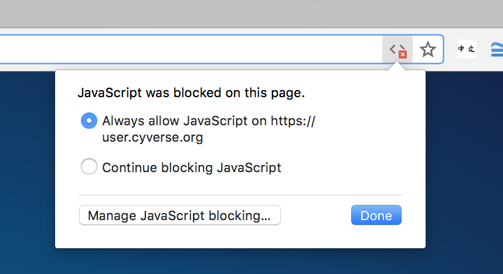

# Setting Up your CyVerse Account

To use CyVerse's platforms, you will need to create an account.

Here's how to do so:

:octicons-arrow-right-24: Go to the [User Portal](https://user.cyverse.org/register){target=_blank} to begin the registration process. 

You will be asked to enter voluntary demographic information about yourself, your contact info, and what you want to use CyVerse for.

Also, please add your ORCID <https://orcid.org> to your [CyVerse User Profile](https://user.cyverse.org){target=_blank}. If you don't have an ORCID get one today!

Entering demographic information is not a requirement.

!!! Warning "Avoid signing up with a personal `@gmail.com` `@hotmail.com` or private email server if possible"

	CyVerse staff approve every user registration. We receive dozens of spam requests every day.  

	We **strongly recommended** that you use an institutional email address:`.edu`, `.org`, or `.gov` if possible. This will speed the approval process for access to certain CyVerse platforms.

	Email accounts that have computer generated user names, i.e. `student1234@qq.com`, are from foreign IP addresses, or use free email services, like `qq.com`, `hotmail.com`, or `gmail.com` will be scrutinized and may be rejected. 

Complete the registration process.

!!! Success "Make sure to set your email address and user password before exiting the User Portal account creation wizard."

	In order to reset a password, you will need to have created one in the first place.

	In order to receive a password reset request, you will need to have access to the email account you signed up with.

:octicons-arrow-right-24: Check your email for an account confirmation link and follow the confirmation instructions.

Once you have confirmed your email address, you can start using your CyVerse account immediately!

!!! Tip "Pop-up-blockers"

	When signing up for an account, be sure that Java Script is enabled on your web browser and that any pop-up blockers are disabled.

	{width="250"}

!!! Tip "Check-your-spam folder"

	Check your SPAM folder for the confirmation email if it does not arrive within a few minutes.

## Request Other Services

New basic account holders will have immediate access to the [Discovery Environment https://de.cyverse.org](../de/index.md), and [Data Store](../ds/index.md).

To register for other services and platforms, login to the [User Portal's dashboard](<https://user.cyverse.org/dashboard>){target=_blank}. Under "My Services" click the 'Request Access' button next to the service(s) you would like to access. You will receive an email notification when the service is added; this may take up to 24 hours.

## Account Types

CyVerse financial sustainability model now includes a tiered subscription service where individuals can use free 'basic' tiered services for a limited amount of time.

To leverage CyVerse for research or education, you must:

(1) purchase an individual subscription (see table below), 
	
(2) connect with us to develop an Institutional agreement (see [Professional Services](https://cyverse.org/professional-service){target=_blank} or [Powered By](https://cyverse.org/powered-by-cyverse){target=_blank}), 
	
(3) are part of a funded research project which has an existing Professional Services agreement with CyVerse. 

(4) are a current student or a faculty member at an Institution CyVerse is currently serving (specifically, the University of Arizona).

### Individual Subscriptions

In order to purchase an individual CyVerse subscription, please see [Subscribe](https://cyverse.org/subscriptions)

**Table:** CyVerse Individual Subscription Tiers (Spring 2025)

| Service  | Basic (Free) | Regular | Pro | Commercial|
|----------|--------------|---------|-----|-----------|
| Discovery Environment	| Yes |	Yes |	Yes	| Yes |
| Data Store |	Yes	| Yes	| Yes	| Yes |
| Advanced Features & APIs |	- |	- |	Yes |	Yes |
| Data Storage Limit |	5 GB |	50 GB |	4 TB |	7 TB |
| Compute Units / Year*	| 200 |	1,000 |	25,000 |	250,000 |
| Access to GPU** |	- |	- |	contact us |	contact us |
| Concurrent Jobs |	1 |	2 |	4 |	8 |
| Sharing Data & Apps |	None | 100	| Unlimited	 | Unlimited |
| Community Released Data Folder Requests |	None | Yes	Yes |	Yes| 
| DOI for Data| 	None	| 5	| 10	| 20| 
| Workshop Requests	| -	| - | 	4 | 	8 |
| Webinar Access	| Yes	| Yes |	Yes | 	Yes |
| Support| 	Email | 	In-App Chat	| Screen Share Support | Screen Share Support |
| Price / Year	| Free	| $200	| $400	| $2,400 |

!!! Success "Teaching with CyVerse"

	CyVerse was built as a free to use, open source cyberinfrastructure project for everyone to use. It is a privilege to offer access to the most cutting edge data science tools and computing environments in the world to students from the most under resourced and under served corners of our country with the worst internet connections.

	Free "basic" account holders are intended to be undergraduates or continuing education students. The "basic" account comes with enough computing hours in the Discovery Environment for a student to complete two semester's worth (one academic year) of a courses computational assignments.

	Students should be mindful of their allocation hours and use them conservatively. Analyses should not be left idle or running overnight when not in use, as they take away from the shared resource pool, and they rapidly deplete a student's free account.

	Teachers should purchase a "Pro" or "Commericial" subscription, so that they can share data with their students, and request a Community Release folder, if need be. 

## [Professional Services](https://cyverse.org/professional-services "Click here to learn more or request information"){target=_blank}

For over a decade CyVerse has partnered with other universities, private companies, and governmental and non-govermental organizations to provide services.

## [Powered-by CyVerse](https://cyverse.org/powered-by-cyverse "Click here to learn more about CyVerse advanced services")

Organizations may be interested in leveraging parts of CyVerse software stack or cyberinfrastructure for their own clouds, gateways, or projects.

Partnerships with CyVerse for Centers, Institutes, and Large Projects are managed through our [Powered-by](home/powered_by.md) project documentation.

