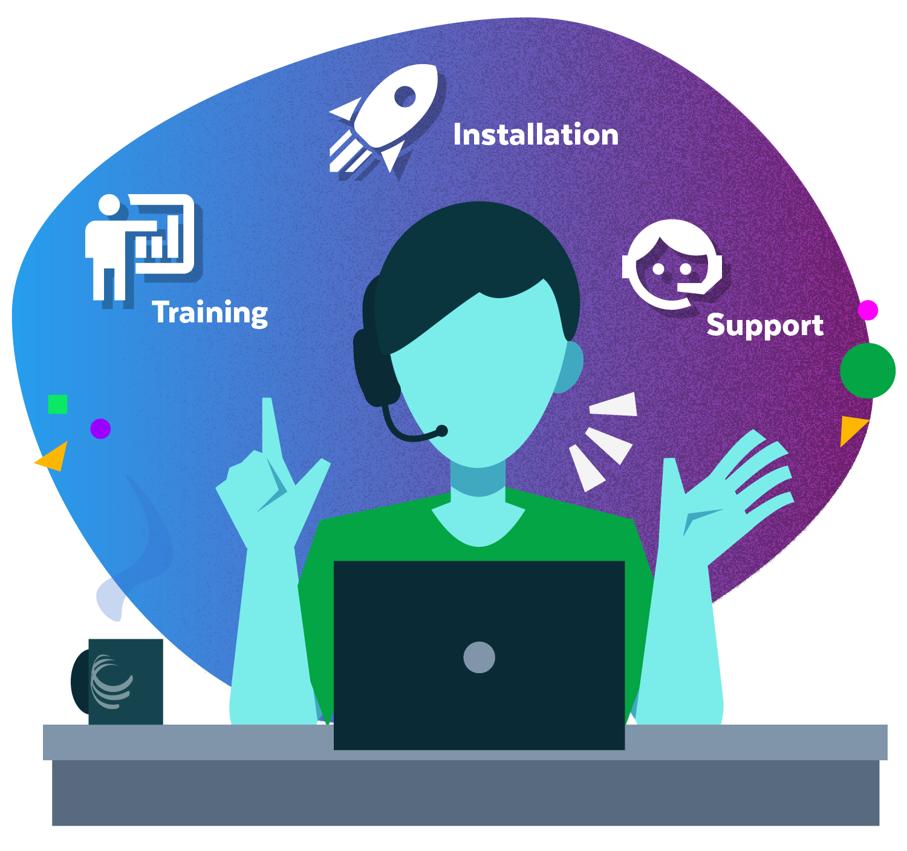

{ width="400" }

# Leveraging CyVerse Services

CyVerse public platform provides a nominal quantity of compute and data storage to all of our users. 

For researchers who need more, we also provide mechanisms for extending and powering your research.

{ width="400" }

## [Professional Services](https://cyverse.org/professional-services){target=_blank}

CyVerse offers a suite of services for institutions seeking to deploy CyVerse's cyberinfrastructure locally. With a secure, shared data management and computing environment with increased speed and performance, a local installation can better support your members' research and teaching needs for:

- Security compliance (e.g., HIPAA, ITAR, ISO, etc.)
- Federation with local and commercial cloud and high-performance computing
- Integration with local user identity management systems

Our professional services include installation, maintenance, and training for local installations of CyVerse.

Because CyVerse fully supports open source practices, you can access all of our open source infrastructure code and architecture diagrams on [Github](https://github.com/cyverse){target_blank}.

[Contact Us](https://docs.google.com/forms/d/e/1FAIpQLSd2BqXi8DlVOeab28ZWPeUhttGqqMczMBxr8Fu1j2ud0bL3_w/viewform){target=_blank} if you're interested in knowing more.

## [Powered by CyVerse](https://cyverse.org/powered-by-cyverse){target=_blank}

Through our unique Powered by CyVerse program, third-party projects can leverage CyVerse cyberinfrastructure to provide their users with robust services such as secure single sign-on with authentication, easy and fast data transfers, access to large-scale, High-Performance Compute resources such as Jetstream or XSEDE, as well as expertise from developers and domain scientists.

## [External Collaborative Partnership](https://cyverse.org/ecp){target=_blank}

External Collaborative Partnerships (ECP) pair you with an expert staff member to address the computational needs of your specific scientific project.

To be considered for a partnership, review the below criteria and complete the [ECP Request Form](). CyVerse does not provide funding support for external projects.

