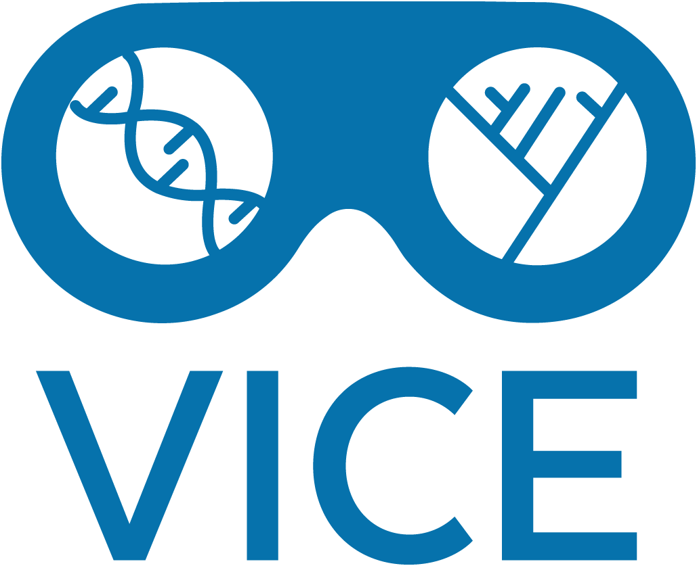
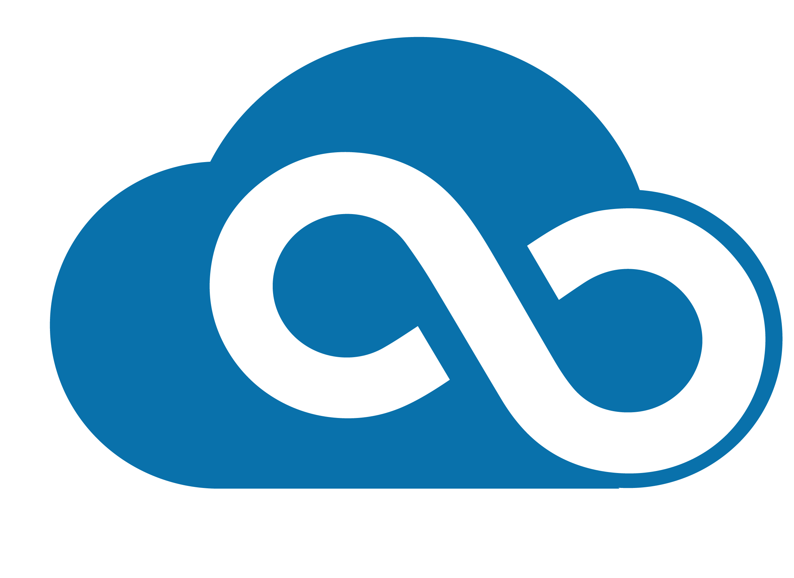

{ width="400" }

# Welcome to the Learning Center

[CyVerse](https://cyverse.org) provides life scientists with powerful computational infrastructure to handle huge datasets and complex analyses, thus enabling data-driven discovery.

{ width="600" }

**[{ width="30" }](what_is_cyverse.md) [What is CyVerse?](what_is_cyverse.md)**

**[{ width="30" }](account.md) [Creating a CyVerse account](account.md)**

**[{ width="30" }](ds/intro.md) [Data Store](ds/intro.md)**

**[{ width="30" }](de/intro.md) [Discovery Environment](de/intro.md)**

[{ width="30" }](vice/about.md) [Visual Interactive Compute Environment (VICE)](vice/about.md)

- VICE features popular development environments: JupyterLab, RStudio, and VSCode
- Instant and on demand virtual machines running Ubuntu Linux command line interface
- Remote Desktops for high quality visualizations in your browser
- GPU computing for machine learning and artificial intelligence

**[{ width="30" }](atmo/intro.md) [Cloud](atmo/intro.md)**

- CyVerse created [Atmosphere](atmo/atmo.md), a browser interface for working with OpenStack Cloud virtual machines
- Partnered with NSF XSEDE/ACCESS [Jetstream-2](https://jetstream-cloud.org) for more and larger virtual machines.

**[What to do first](choose_platform.md)**

**[For Advanced Users](powered_by.md)**

**[For Developers](manuals.md)**

-----------------------------------------------------------------------

**Funding and Citations:**

CyVerse is funded entirely by the National Science Foundation [{width="25"}](https://nsf.gov) under Award Numbers:

    

Please cite CyVerse appropriately when you make use of our resources, see [CyVerse citation policy](https://cyverse.org/policies/cite-cyverse).

-----------------------------------------------------------------------

**Fix or improve this documentation**

  - Search for an answer:
     [CyVerse Learning Center](https://learning.cyverse.org)
  - Ask us for help:
    click the Intercom icon { width="25" } on the lower right-hand side of the page
  - Report an issue or submit a change:
    [Github Repo Link](https://github.com/cyverse-learning-materials/)
  - Send feedback: <Tutorials@CyVerse.org>
  
------------------------------------------------------------------------

[Learning Center Home](http://learning.cyverse.org/)
