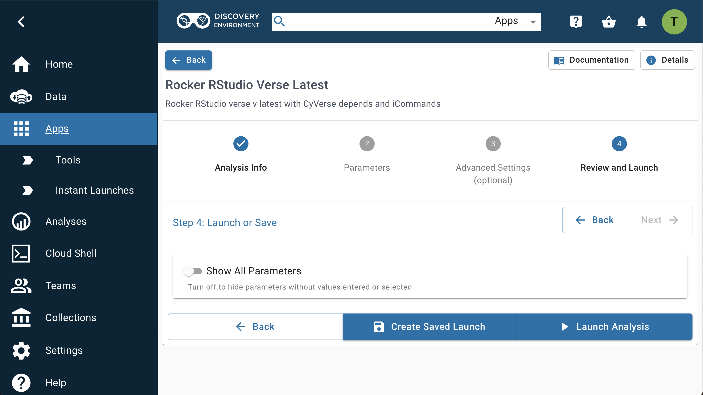

# RStudio in 6 Steps

## 1. Log into Discovery Environment

Log into <https://de.cyverse.org>

If you have not yet created an account, go to the [User Portal](https://user.cyverse.org) and sign up.

## 2. Launch the App

[![rstudio_1]][rstudio_1]

  [rstudio_1]: ../assets/de/rstudio_1.png

Click on the **Apps** grid icon

[RStudio Verse](https://de.cyverse.org/apps/de/3548f43a-bed1-11e9-af16-008cfa5ae621/launch) is in "Featured Apps".

[Instant Launches](https://de.cyverse.org/instantlaunches) start Apps immediately when clicked.

The conventional launch menu allows you to modify the App parameters. You can add input data, increase the amount of RAM or CPU cores, and change the analysis directory.

[{ width="600" }](https://de.cyverse.org/apps/de/3548f43a-bed1-11e9-af16-008cfa5ae621/launch)

## 3. Open the Analysis

After you have started a VICE app, a new tab will automatically open in your browser and take you to the loading screen.

[![rstudio_3]][rstudio_3]

  [rstudio_3]: ../assets/de/rstudio_3.png


Once the app is ready, it will transition to the user interface. 

[![rstudio_4]][rstudio_4]

  [rstudio_4]: ../assets/de/rstudio_4.png


**RStudio Interface:** 
RStudio is a free, open source IDE (integrated development environment) for R. 
Its interface is organized so that the user can clearly view graphs, data tables, R code and ouput at the same time. 
It also offers an Import-Wizard-like feature that allows users to import CSV, Excel, SAS (*.sas7bdat), SPSS (*.sav), and Stata (\*.dta) files into R without having to write the code to do so.

More information about RStudio can be found [here](https://www.rstudio.com/products/rstudio/).

!!! Note
  
  Normal wait time for launching a featured VICE app is less than 2 minutes. 
  If you're experiencing a significantly longer wait, consider terminating the Analysis and starting a new one.

## 4. Create an RStudio Project

You can create RStudio projects using local data, or from Git.

[![rstudio_5]][rstudio_5]

  [rstudio_5]: ../assets/de/rstudio_5.png

This example uses [Leaflet Maps](https://github.com/rstudio/leaflet) in RStudio.

[![rstudio_6]][rstudio_6]

  [rstudio_6]: ../assets/de/rstudio_6.png

You can then run R commands and install packages.

[![rstudio_7]][rstudio_7]

  [rstudio_7]: ../assets/de/rstudio_7.png

[![rstudio_8]][rstudio_8]

  [rstudio_8]: ../assets/de/rstudio_8.png

## 5. Using `icommands`

Open RStudio's Terminal.

To connect to the CyVerse Data Store, you can initiate an iRODS iCommands `iinit`.

You should now be connected to your `/iplant/home/username` home directory.

### ils

``` ils /iplant/home/username/ ```

To view the 'shared' directory, type:

``` ils /iplant/home/shared ```

### iget 

Download data into your Cloud Shell with [iCommands](https://docs.irods.org/master/icommands/user/) by running `iget`.

``` iget -KPbvrf /iplant/home/shared/cyverse_training/ ```

### iput

After finishing your analyses, you can save the outputs back to your Data Store.

Use `iput` to copy your new files back to your user space, or if you've left your new work in the `/home/user/work/data/outputs` folder, it will be copied back to your `/iplant/home/username/Analyses/` directory.

You can find the outputs you generated (if any) using the same steps as before, but this time select the 'Go To Output Folder'.

## 6. Terminate your app

The Discovery Environment is a shared system. In fairness to the community, users should "Terminate" any apps that
are no longer actively running analyses.

In the Analyses window, select the app (by clicking the checkbox next to it), then select "More Actions", then "Terminate" to shut down the app.

[![rstudio_9]][rstudio_9]

  [rstudio_9]: ../assets/de/rstudio_9.png


Any new data in the `/home/rstudio/work/data/output` directory will begin copying back to your folder at this time.

Any input data which you added when the app started using the conventional launch feature will *not* be copied.

!!! Warning

  VICE apps run for a pre-determined amount of time, typically between 4 and 48 hours. 
  If you have opted for email notifications from the DE, then you'll get a notification 1 day before and another 1 hour before the app will terminate. 
 To extend the pre-set run time, go to your analysis and click the hour glass icon which automatically extends the app run time.
