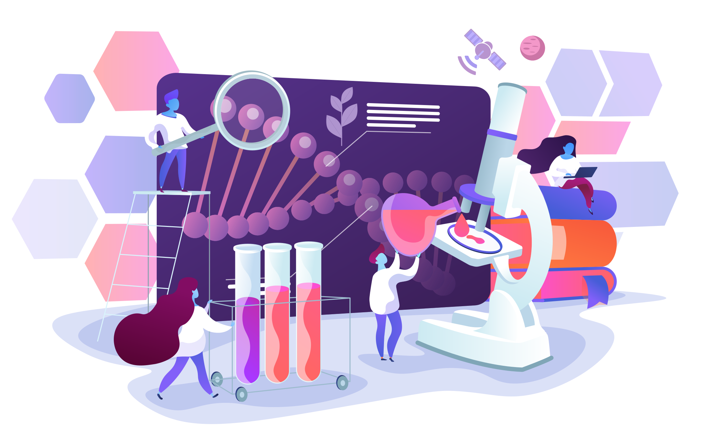

<figure markdown>
  [{ width="600" }](https://learning.cyverse.org){target=_blank}
</figure>

 

# Welcome to the ***CyVerse Learning Center*** *!*

[CyVerse](https://cyverse.org) provides life scientists with powerful computational infrastructure to handle huge datasets and complex analyses, thus enabling data-driven discovery.

In the Learning Center, you can find information about CyVerse platforms and documentation on how to use features and services, quick starts for data management and analysis tasks, tutorials, and more. Use the navigation bar on the left side of the screen or the search bar at the top to explore the learning materials.

<figure markdown>
  {width="600"}
</figure>

## First Steps

These are some good places to start learning about what CyVerse has to offer:

### **[{ width="30" }](what_is_cyverse.md) [What is CyVerse?](what_is_cyverse.md)**

Get a quick overview of CyVerse's platforms, services, and infrastructure.

### **[{ width="30" }](account.md) [Creating a CyVerse account](account.md)**

Create an account and get started using CyVerse.

### **[{ width="30" }](mooc.md) [Self-Guided Tour](mooc.md)**

Take a self-guided course on using CyVerse to manage data and run analyses. 

-----------------------------------------------------------------------

**Funding and Citations:**

CyVerse is funded entirely by the National Science Foundation [{width="25"}](https://nsf.gov) under Award Numbers:

    

The CyVerse Zenodo Community has published, citable versions of CyVerse materials.

Please cite CyVerse appropriately when you make use of our resources; see [CyVerse citation policy](https://cyverse.org/policies/cite-cyverse).

