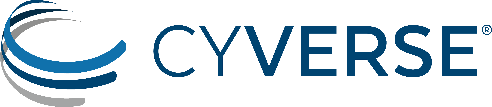

.. include:: cyverse_rst_defined_substitutions.txt

|CyVerse logo|

**Welcome to the CyVerse Learning Center**

The CyVerse Learning center is a release of our learning materials in the
popular "Read the Docs" formatting. We are transitioning our leaning materials from our wiki
into this format to make them easier to search, use, and update. We will be
making regular contributions to these materials, and you can suggest new
materials or create and share your own. If you have ideas or suggestions please
email `Tutorials@CyVerse.org <mailto:Tutorials@cyverse.org>`_. You can also
view, edit, and submit contributions on |Github|.

Getting Started
----------------

- |Create a CyVerse account|
- `Getting Started Webinar <https://www.youtube.com/channel/UC-gvdjTz9rq6RovZ57LoDDA>`_ - Every 1-2 months. Watch recent webinars
- `About Cyverse <https://cyverse.org/about>`_
- |CyVerse FAQ|

-----

Training
----------------

- `Quick Starts <./quick_starts.html>`_
- `Platform Guides <./platform_guides.html>`_
- `Tutorials <./tutorials.html>`_
- `Workshops <./workshops.html>`_

-----

Get Involved
----------------

- `Intergrate your own Tools and Apps <./tools_and_apps.html>`_
- `Contributing to the Learning Center <./contributing.html>`_
- `Powered by CyVerse <https://www.cyverse.org/powered-by-cyverse>`_

-----

External Collaborative Partnerships
------------------------------------
The |External Collaborative Partnership| program pairs members of our user community with expert staff to address the computational needs of a specific scientific project. To participate, please review the required criteria and then complete the |ECP Request web form|. CyVerse does not provide funding support for external projects.

----

**CyVerse Homepage:** |CyVerse Homepage|

**Funding and Citations:**

CyVerse is funded entirely by the National Science Foundation under
Award Numbers DBI-0735191, DBI-1265383, and DBI-1743442.

Please cite CyVerse appropriately when you make use of our resources, see 
|CyVerse citation policy|.

----

**Fix or improve this documentation**

- On Github: `Repo link <https://github.com/CyVerse-learning-materials/Visual_Interactive_Computing_Environment>`_
- Send feedback: `Tutorials@CyVerse.org <Tutorials@CyVerse.org>`_

----

.. |platform_stack| image:: ./img/cyverse_platform_stack.png
  :width: 750

.. |GitHub| raw:: html

   <a href="https://github.com/CyVerse-learning-materials" target="blank">GitHub</a>

.. |documentation Quickstart| raw:: html

    <a href="https://learning.cyverse.org/projects/Documentation-Quickstart/en/latest/" target="blank">Documentation Quickstart</a>

.. |Create a CyVerse account| raw:: html

    <a href="http://learning.cyverse.org/projects/cyverse-account-creation-quickstart/" target="blank">Create a CyVerse account</a>

.. |Import data from NCBI SRA using the Discovery Environment| raw:: html

    <a href="http://learning.cyverse.org/projects/cyverse-importing-sradata-quickstart/" target="blank">Import data from NCBI SRA using the Discovery Environment</a>

.. |Evaluate High-throughput Sequencing Reads with FastQC| raw:: html

    <a href="https://cyverse-fastqc-quickstart.readthedocs-hosted.com/en/latest/" target="blank">Evaluate High-throughput Sequencing Reads with FastQC</a>

.. |Filter, Trim, and Process High-throughput Sequencing Reads with Trimmomatic| raw:: html

    <a href="https://cyverse-trimmomatic-quickstart.readthedocs-hosted.com/en/latest/" target="blank">Filter, Trim, and Process High-throughput Sequencing Reads with Trimmomatic</a>

.. |Submit High-throughput Sequencing Reads to NCBI Sequence Read Archive (SRA)| raw:: html

    <a href="https://learning.cyverse.org/projects/sra_submission_quickstart/en/latest/" target="blank">Submit High-throughput Sequencing Reads to NCBI Sequence Read Archive (SRA)</a>

.. |RNA-Seq with Kallisto and Sleuth| raw:: html

    <a href="https://cyverse-kallisto-tutorial.readthedocs-hosted.com/en/latest/" target="blank">RNA-Seq with Kallisto and Sleuth</a>

.. |CyVerse NEON Data Institute 2018| raw:: html

    <a href="https://cyverse-neon-data-institute-2018.readthedocs-hosted.com/en/latest/" target="blank">2018 NEON Data Institute</a>

.. |NEON Data Institute 2018| raw:: html

    <a href="https://www.neonscience.org/neon-data-institute-2018/" target="blank">NEON Data Institute 2018</a>

.. |EZ installation of popular data science tools| raw:: html

    <a href="https://cyverse-ez-quickstart.readthedocs-hosted.com/en/latest/" target="blank">EZ installation of popular data science tools</a>

.. |CyVerse citation policy| raw:: html

    <a href="http://www.cyverse.org/acknowledge-cite-cyverse" target="blank">CyVerse citation policy</a>

.. |CyVerse homepage| raw:: html

    <a href="http://www.cyverse.org" target="blank">http://www.cyverse.org</a>

.. |Association analysis with mixed models| raw:: html

    <a href="https://cyverse-sciapps-guide.readthedocs-hosted.com/en/latest/association.html" target="blank">Association analysis with mixed models</a>

.. |Genome Annotation with MAKER| raw:: html

    <a href="https://cyverse-sciapps-guide.readthedocs-hosted.com/en/latest/annotation.html" target="blank">Genome Annotation with MAKER</a>

.. |Vice Documentation| raw:: html

    <a href="https://learning.cyverse.org/projects/vice" target="blank">Vice Documentation</a>

.. |Request a DOI| raw:: html

    <a href="https://cyverse-doi-request-quickstart.readthedocs-hosted.com/en/latest/" target="blank">Request a DOI</a>

.. |Create a Group Project| raw:: html

    <a href="https://cyverse-group-project-quickstart.readthedocs-hosted.com/en/latest/" target="blank">Create a Group Project</a>

.. |CyVerse Container Camp 2019| raw:: html

    <a href="https://learning.cyverse.org/projects/container_camp_workshop_2019/en/latest/" target="blank">CyVerse Container Camp 2019</a>

.. |Creating and Running Docker Containers| raw:: html

    <a href="https://cyverse-creating-docker-containers-quickstart.readthedocs-hosted.com/en/latest/" target="blank">Creating and Running Docker Containers</a>

.. |CyVerse FAQ| raw:: html

    <a href="https://cyverse-learning-center-faq.readthedocs-hosted.com/en/latest/" target="blank">CyVerse FAQ</a>

.. |Condensed R: 240-minute tutorial| raw:: html

    <a href="https://cyverse-240-minute-r-tutorial.readthedocs-hosted.com/en/latest/" target="blank">Condensed R: 240-minute tutorial</a>

.. |CyVerse Tools and Services Workshop| raw:: html

    <a href="https://cyverse-cyverse-tools-and-services-workshop.readthedocs-hosted.com/en/latest/" target="blank">CyVerse Tools and Services Workshop</a>

.. |CyVerse Foundational Open Science Skills 2019| raw:: html

    <a href="https://cyverse-foundational-open-science-skills-2019.readthedocs-hosted.com/en/latest/" target="blank">CyVerse Foundational Open Science Skills 2019</a>

.. |Powered by CyVerse| raw:: html

   <a href="https://cyverse.org/Powered%20by%20CyVerse" target="blank">Powered by CyVerse</a>

.. |External Collaborative Partnership| raw:: html

    <a href="https://www.cyverse.org/researchers" target="blank">External Collaborative Partnership</a>

.. |ECP Request web form| raw:: html

    <a href="https://user.cyverse.org/forms/3" target="blank">ECP Request web form</a>
    
.. |Getting Started Webinar| raw:: html

    <a href="https://www.youtube.com/channel/UC-gvdjTz9rq6RovZ57LoDDA" target="blank">Getting Started Webinar</a>
    
.. |About CyVerse| raw:: html
    
    <a href="https://www.cyverse.org/about" target="blank">About CyVerse</a>
    
.. |Powered by CyVerse| raw:: html

    <https://www.cyverse.org/powered-by-cyverse>
    
 .. |Quickstarts| raw:: html

    <https://www.cyverse.org/powered-by-cyverse>
